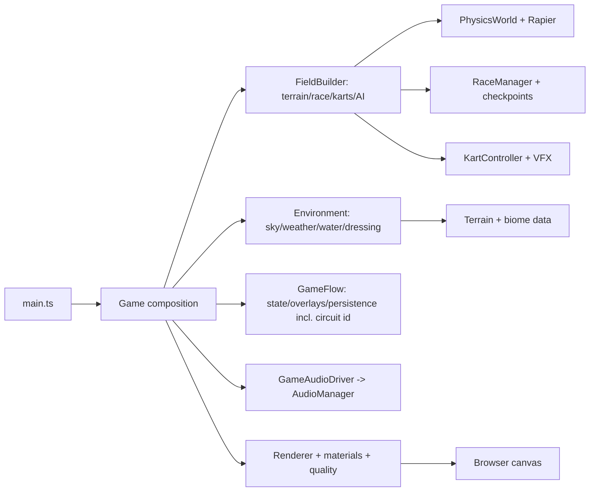
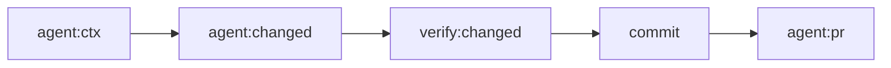

# Agent Guidelines

## Game Identity

This is a vibes-first exploration and adventure kart game with a strong
painterly art style ("Painted Wilds"). Mood, atmosphere, and a striking art
feel are first-class — never arcade gloss. Each biome carries its own distinct
art vibe; see `docs/knowledge/conventions/art-direction.md`.

## Directory Map

```text
./                       # game-cart root
├── .githook/            # local git hooks
│   └── pre-commit.d/    # hook checks
├── .github/             # GitHub automation
│   └── workflows/       # CI/deploy flows
├── docs/                # knowledge wiki + case logs
│   ├── knowledge/       # OKF v0.1 architecture wiki (single source of truth)
│   └── troubleshooting/ # case logs
├── src/                 # game source; see src/AGENTS.md
└── tools/               # agent, verify, lint, test config
```

## Runtime Flow



## AGENTS.md

- Every `AGENTS.md` MUST include annotated dir tree for dirs below it.
- Stop tree at child dir with own `AGENTS.md`; child file owns subtree.
- Each dir with `AGENTS.md` needs a `CLAUDE.md` symlink: `ln -s AGENTS.md CLAUDE.md` (never copy).
- Keep each `AGENTS.md` under 250 lines. This repo enforces 200 lines.
- Split dir-specific detail into nested `AGENTS.md` before root grows.
- Every `AGENTS.md` MUST include at least one Mermaid diagram.
- Diagram shows flow or state, not folder layout.
- Every nested `AGENTS.md` MUST include a `@docs/knowledge/<dir>/index.md`
  link to the matching knowledge wiki index.

## Agent Workflow



- Start each session with `npm run agent:ctx`; use that before broad discovery.
- Run `npm run agent:changed` before choosing checks.
- Use `npm run agent:state` when handoff/resume needs compact local state.
- Use `npm run agent:pr` for compact PR/check status when branch has PR.
- Use `npm run agent:handoff` before spawning subagents.
- Give subagents compact context plus exact scope.
- Subagents return only: files changed, commands run, failures/fixes, risks.
- Main agent owns final `npm run verify`, commit, push, PR.
- Do not paste raw logs into chat. Use capped output plus log path.
- Hook failures are blockers. Read concise error, fix root cause, rerun
  smallest relevant command, retry.
- Runtime agent files live under ignored `.agent/`; commit helper code only.

## Dev/Agent Tooling

Gated behind a dev build or `?debug`; prod clean, captures runtime-only. Full
set (`window.__game.debugSnapshot()`, URL flags `?biome=&seed=&autostart`,
`?freefly` cam, `?garage` viewer, `npm run shoot`) in `docs/knowledge/dev/` +
`docs/knowledge/core/`.

Kart-model vision loop: `npm run shoot -- --garage --variant <id> --views
front,side,top,iso [--ref <photo>]` renders to-scale ortho front/side/top + iso
with a burned-in dimension overlay plus a `window.__garage.snapshot()`
measurements JSON under `.agent/shots/`. Read them, edit the model def
`src/kart/models/<id>.ts`, re-shoot, compare.

## Code Quality

- Enforce rules automatically where possible: hooks first, CI as backstop.
- Every language MUST have strict lint plus auto-format. Markdown included.
- Hooks live in `.githook/`; commits fail on lint or unformatted code.
- Configure git via `npm run setup` or `git config core.hooksPath .githook`.
- No hand-written file exceeds 600 lines; keep hand-written lines to
  100 chars. Generated, vendored, lock, minified, snapshot files exempt.
- Only unbreakable URLs, hashes, similar tokens may exceed 100 chars.
- Treat linter warnings as errors. Fix root cause.
- Inline suppressions need rule code plus reason comment.
- CI (`.github/workflows/ci.yml`) runs format -> typecheck -> lint ->
  lint:secrets -> test -> build -> lint:repo on PR/main; Node from
  `.nvmrc`. PRs add actionlint + PR-title check (`pr-title.yml` runs
  `.githook/commit-msg`; titles become squash subjects).
- Green `ci` gates deploys: `deploy` ships tested `dist/` to Cloudflare
  Pages on main; `preview` posts per-PR URLs (skips forks/Dependabot).
  Actions SHA-pinned.
- `npm run verify` mirrors CI. `npm run verify:push` is the pre-push gate.
- `npm run verify:changed` picks cheaper checks from changed files.
- Dependabot (`.github/dependabot.yml`): weekly `chore(deps)` PRs; patches
  auto-merge on green CI (needs repo "Allow auto-merge" ON).

## Commits

- Every change is committed; one atomic change per commit.
- Each commit must leave build, lint, tests green.
- No mixing refactors or formatting into behavior changes.
- Subject: Conventional Commits `type(scope?): subject`; imperative mood, about 50 chars, no period.
- Allowed types: `feat`, `fix`, `docs`, `refactor`, `test`, `perf`,
  `build`, `ci`, `chore`, `style`, `revert`.
- Non-trivial commit body needs sections:
  `Context`, `Change`, `Rationale`, `Impact/Risk`, `Tests`.
- Body explains what and why, not how. Wrap around 72 chars.
- Breaking changes use `type(scope)!:` or `BREAKING CHANGE:` footer.
- Link issues via `Fixes #123`/`Refs #123`; if none, body states why.
- No AI trailers (`Co-authored-by:`, `Generated-by:`, `Assisted-by:`,
  `Model:`); allowed: `Fixes`, `Refs`, `BREAKING CHANGE`, `Signed-off-by`
  (human only).

## Git Workflow

- No `WIP`/vague messages; failing commits forbidden on shared branches.
- Start each task on a fresh branch cut from latest `origin/main` (`git fetch origin` first).
- Every change ships via a PR: push the branch, open a PR; never push to `main` directly.
- Rebase is the only integration strategy; never merge-commit. Rebase
  onto latest `origin/main`; squash before PR/merge.
- Checkpoints stay local or on scratch branch until green and reviewable.
- Pre-commit runs the staged gate (`verify.mjs staged`); it auto-runs
  tests when `src/`/`test/` stage. `verify:push` is the fuller gate.

## Project Docs

- ALL project knowledge MUST be recorded in `docs/knowledge/`. It is the
  single source of truth for architecture, subsystem behavior, decisions,
  and conventions; nothing durable lives only in chat, commits, or PRs.
- There is no backlog/task-file system. Do not create `docs/backlog/`,
  `docs/todo.md`, or similar task trackers. Durable outcomes of work go
  into the matching `docs/knowledge/` concept.
- Every commit that changes `src/` MUST also touch a `docs/knowledge/*.md`
  file. Enforced by the `09-knowledge-freshness` pre-commit hook and a CI
  step on PRs; no bypass.
- Keep `docs/knowledge/` current with code: behavior, public API, ownership,
  lifecycle, data flow, or subsystem invariant changes update the matching
  OKF knowledge file in the same commit.
- `docs/knowledge/` follows [OKF v0.1][okf-spec]. Concept docs require
  frontmatter `type`, `title`, `description`, `tags`, and ISO-8601 UTC
  `timestamp`. `npm run lint:okf` enforces this plus source-path liveness
  (backtick `src/`/`test/` refs must exist) and rejects task-ID/PR refs.
- Knowledge docs are factual architecture notes, not task history. Prefer
  source-linked current behavior over task IDs, PR refs, or old plan text.
- Run `npm run lint:okf` after knowledge edits; use `npm run verify:changed`
  before commit.
- Troubleshooting needs case file in `docs/troubleshooting/<DATE>_<SUBJECT>.md`;
  append steps as work proceeds.

## Repo-Specific Rules

- Zero committed media or binary assets by default; pre-commit rejects
  staged asset/binary extensions.
- Use procedural or code-native visuals/audio unless policy changes.
- Secretlint scans staged content for secrets.
- Static deploy keeps relative asset paths for sub-path/preview
  hosting (Cloudflare Pages); Vite owns dev/build/preview, keep minimal.

## Subsystem Invariants

Cross-cutting invariants are documented in `docs/knowledge/conventions/` and
`docs/knowledge/terrain/height-pipeline.md`.

Near-terrain surface detail (069) is shading-only: fbm albedo mottle +
micro-normal bump fold into the near CelMaterial fragment behind a
`SURFACE_DETAIL` define, tier-gated (low off). `heightAt`, the trimesh
collider, and suspension raycasts are untouched; mesh and collider verts
stay identical by construction. Off-path fragment source is byte-identical
to the pre-069 shader (no define, no uniforms).

Menu/overlay chrome (072) is biome-neutral editorial: kicker + serif
heading + hairline/telemetry/corner/vignette/grain from pure cssText
builders in `src/ui/menuStyles.ts`. No warm palette (that is 073's scene
only); focus outlines keep `MENU_ACCENT`. Builders stay DOM-free so jsdom
specs assert on strings.

## Writing Style

- Max info density, easy read. Abbrev common prose: DB, auth, config, req,
  res, fn, impl. Strip filler; fragments fine. `X -> Y` for causality.
  Keep code symbols, fn names, API names, error strings verbatim.
  Never use bold unless critical. Headings unnumbered. No emojis.

[okf-spec]: https://raw.githubusercontent.com/GoogleCloudPlatform/knowledge-catalog/refs/heads/main/okf/SPEC.md
