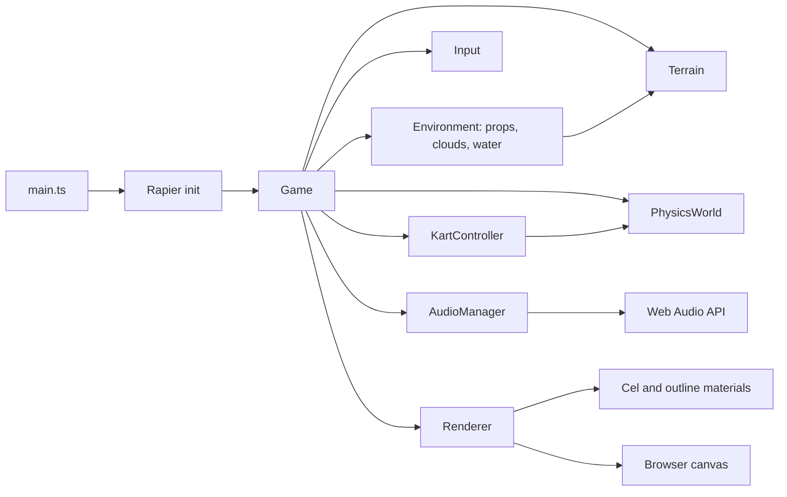

# Agent Guidelines

## Directory Map

```text
./                       # game-cart root
├── .githook/            # local git hooks
│   └── pre-commit.d/    # hook checks
├── .github/             # GitHub automation
│   └── workflows/       # CI/deploy flows
├── docs/                # backlog and notes
│   ├── backlog/         # task files
│   │   ├── done/        # reviewed tasks
│   │   ├── open/        # planned tasks
│   │   └── pending-review/ # done, awaiting review
│   └── troubleshooting/ # case logs
├── src/                 # game source
│   ├── audio/           # Web Audio engine/drift/wind/UI (005)
│   ├── core/            # loop, render, input, rng, game state (006)
│   ├── environment/     # props, water, clouds (004)
│   ├── kart/            # kart physics, mesh, chase/menu cam (006)
│   ├── materials/       # cel + outline materials, tests
│   ├── physics/         # Rapier wrapper
│   ├── terrain/         # heightmap, spline, terrain mesh
│   └── ui/              # DOM overlays: start menu, countdown (006)
└── tools/               # lint, format, test config
```

## Runtime Flow



## AGENTS.md

- Every `AGENTS.md` MUST include annotated dir tree for dirs below it.
- Stop tree at child dir with own `AGENTS.md`; child file owns subtree.
- Each dir with `AGENTS.md` MUST also have `CLAUDE.md` symlink to it.
- Create link with `ln -s AGENTS.md CLAUDE.md`; commit link, never copy.
- Keep each `AGENTS.md` under 250 lines. This repo enforces 200 lines.
- Split dir-specific detail into nested `AGENTS.md` before root grows.
- Every `AGENTS.md` MUST include at least one Mermaid diagram.
- Diagram shows flow or state, not folder layout.
- Refresh `AGENTS.md` after about 1000 LOC change below its dir.

## Code Quality

- Enforce rules automatically where possible: hooks first, CI as backstop.
- Every language MUST have strict lint plus auto-format. Markdown included.
- Hooks live in `.githook/`; commits fail on lint or unformatted code.
- Configure git via `npm run setup` or `git config core.hooksPath .githook`.
- No hand-written file may exceed 600 lines.
- Generated, vendored, lock, minified, snapshot files exempt from 600-line cap.
- Keep every hand-written line to 100 chars.
- Generated and vendored files exempt from 100-char line cap.
- Only unbreakable URLs, hashes, and similar tokens may exceed 100 chars.
- Treat linter warnings as errors. Fix root cause.
- Inline suppressions need rule code plus reason comment.

## Commits

- Every change must be committed.
- Make one atomic change per commit.
- Each commit must leave build, lint, tests green.
- Do not mix refactors with behavior changes.
- Do not mix formatting with functional changes.
- Subject uses Conventional Commits: `type(scope?): subject`.
- Allowed types: `feat`, `fix`, `docs`, `refactor`, `test`, `perf`,
  `build`, `ci`, `chore`, `style`, `revert`.
- Subject uses imperative mood, about 50 chars, no period.
- Non-trivial commit body needs sections:
  `Context`, `Change`, `Rationale`, `Impact/Risk`, `Tests`.
- Body explains what and why, not how. Wrap around 72 chars.
- Breaking changes use `type(scope)!:` or `BREAKING CHANGE:` footer.
- Link issues via `Fixes #123` or `Refs #123`.
- If no issue exists, body must state why.
- No AI attribution trailers. Forbidden: `Co-authored-by:`, `Generated-by:`,
  `AI-Generated-by:`, `Assisted-by:`, `Model:`.
- Allowed trailers: `Fixes`, `Refs`, `BREAKING CHANGE`, `Signed-off-by`
  from human only.

## Git Workflow

- No `WIP` or vague commit messages.
- Checkpoints stay local or on scratch branch until green and reviewable.
- Rebase or squash before PR/merge.
- Run tests before every commit: fast suite or targeted changed-area tests.
- Failing commits are forbidden on shared branches.

## Project Docs

- Tasks live in `docs/backlog/` as `<index>_<task-slug>.md`.
- `docs/backlog/open/` holds open tasks awaiting work.
- `docs/backlog/pending-review/` holds completed work awaiting review.
- `docs/backlog/done/` holds completed and reviewed tasks.
- Move task files between dirs as status changes.
- Use `docs/todo.md`: `- [ ]` open, `- [~]` in progress, `- [x]` done.
- Troubleshooting needs case file in `docs/troubleshooting/<DATE>_<SUBJECT>.md`.
- Append troubleshooting steps as work proceeds.

## Repo-Specific Rules

- Zero committed media or binary assets by default.
- Pre-commit rejects staged asset/binary extensions.
- Use procedural or code-native visuals/audio unless policy changes.
- Secretlint scans staged content for secrets.
- Static deploy must keep relative asset paths for GitHub Pages sub-paths.

## Writing Caveman

- Abbrev common prose words: DB, auth, config, req, res, fn, impl.
- Keep code symbols, function names, API names, error strings verbatim.
- Strip conjunctions and filler. One word when one word works.
- Use `X -> Y` for causality.
- Drop articles and pleasantries.
- Prefer short synonyms: "big" not "extensive", "fix" not "implement".
- Sentence fragments are fine.

## Project conventions

Rendering pipeline lives in `src/core/Renderer.ts` (EffectComposer chain)
and `src/materials/`. Layer numbers: 0 = solid (kart + props, inverted-hull
outline), 1 = terrain/walls (post Sobel outline), 2 = sky (post posterize).
Shared sun/ambient uniforms in `src/materials/lightUniforms.ts` — single
source of truth; Renderer writes once/frame, all materials read by reference.
Custom ShaderMaterials output LINEAR; OutputPass applies ACES + sRGB once.
Tests run under jsdom (no WebGL) — keep WebGL-free pure helpers exported for
unit tests; assert shader source + uniform defaults + RT structure for passes.

Terrain subsystem lives in `src/terrain/`. One shared `heightAt(x,z)` fn
(SplineFieldCache bilinear + simplex hills) feeds BOTH the displaced
PlaneGeometry mesh and the Rapier heightfield collider so physics/visuals
agree by construction — never sample one from the other's raw array.
CelMaterial `vertexColors:true` paints road/grass/rock/sand on layer 1;
vertex color attribute values are sRGB->LINEAR to match ColorManagement.

## Writing Style

- Max info density, easy read.
- Never use bold in Markdown unless info is critical.
- Keep Markdown and text headings unnumbered.
- Never use emojis.
- Use `[ERROR]`, `[WARNING]`, `[INFO]` style tags instead.
