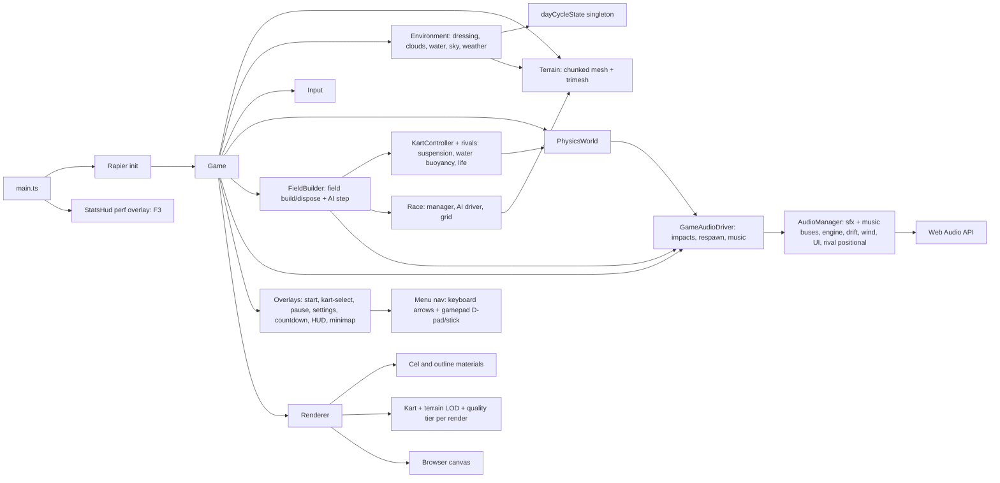

# Agent Guidelines

## Directory Map

```text
./                       # game-cart root
├── .githook/            # local git hooks
│   └── pre-commit.d/    # hook checks
├── .github/             # GitHub automation
│   └── workflows/       # CI/deploy flows
├── docs/                # backlog and notes
│   ├── backlog/         # task files
│   │   ├── concept/     # concept sketches, pre-refinement
│   │   ├── done/        # reviewed tasks
│   │   ├── open/        # planned tasks
│   │   └── pending-review/ # done, awaiting review
│   └── troubleshooting/ # case logs
├── src/                 # game source; see src/AGENTS.md
└── tools/               # agent, backlog, verify, lint, test config
```

## Runtime Flow



## AGENTS.md

- Every `AGENTS.md` MUST include annotated dir tree for dirs below it.
- Stop tree at child dir with own `AGENTS.md`; child file owns subtree.
- Each dir with `AGENTS.md` MUST also have `CLAUDE.md` symlink to it.
- Create link with `ln -s AGENTS.md CLAUDE.md`; commit link, never copy.
- Keep each `AGENTS.md` under 250 lines. This repo enforces 200 lines.
- Split dir-specific detail into nested `AGENTS.md` before root grows.
- Every `AGENTS.md` MUST include at least one Mermaid diagram.
- Diagram shows flow or state, not folder layout.
- Refresh `AGENTS.md` after about 1000 LOC change below its dir.

## Agent Workflow

- Start each session with `npm run agent:ctx`; use that before broad discovery.
- Run `npm run agent:changed` before choosing checks.
- Use `npm run agent:state` when handoff/resume needs compact local state.
- Use `npm run agent:pr` for compact PR/check status when branch has PR.
- Use `npm run agent:handoff` before spawning subagents.
- Give subagents compact context plus exact scope.
- Subagents return only: files changed, commands run, failures/fixes, risks.
- Main agent owns final `npm run verify`, commit, push, PR.
- Do not paste raw logs into chat. Use capped output plus log path.
- Hook failures are blockers. Read concise error, fix root cause, rerun
  smallest relevant command, retry.
- Runtime agent files live under ignored `.agent/`; commit helper code only.

## Code Quality

- Enforce rules automatically where possible: hooks first, CI as backstop.
- Every language MUST have strict lint plus auto-format. Markdown included.
- Hooks live in `.githook/`; commits fail on lint or unformatted code.
- Configure git via `npm run setup` or `git config core.hooksPath .githook`.
- No hand-written file may exceed 600 lines.
- Generated, vendored, lock, minified, snapshot files exempt from 600-line cap.
- Keep every hand-written line to 100 chars.
- Generated and vendored files exempt from 100-char line cap.
- Only unbreakable URLs, hashes, and similar tokens may exceed 100 chars.
- Treat linter warnings as errors. Fix root cause.
- Inline suppressions need rule code plus reason comment.
- CI (`.github/workflows/ci.yml`) runs format -> typecheck -> lint ->
  lint:secrets -> test -> build -> lint:repo on PR/main, Node 24.
- `npm run verify` mirrors CI. `npm run verify:push` is the pre-push gate.
- `npm run verify:changed` picks cheaper checks from changed files.
- Dependabot (`.github/dependabot.yml`) opens one PR per dep, weekly
  Monday, `chore(deps)` prefix. Patch updates auto-merge once CI passes
  (`.github/workflows/dependabot-automerge.yml`; needs repo "Allow
  auto-merge" ON).

## Commits

- Every change must be committed.
- Make one atomic change per commit.
- Each commit must leave build, lint, tests green.
- Do not mix refactors with behavior changes.
- Do not mix formatting with functional changes.
- Subject uses Conventional Commits: `type(scope?): subject`.
- Allowed types: `feat`, `fix`, `docs`, `refactor`, `test`, `perf`,
  `build`, `ci`, `chore`, `style`, `revert`.
- Subject uses imperative mood, about 50 chars, no period.
- Non-trivial commit body needs sections:
  `Context`, `Change`, `Rationale`, `Impact/Risk`, `Tests`.
- Body explains what and why, not how. Wrap around 72 chars.
- Breaking changes use `type(scope)!:` or `BREAKING CHANGE:` footer.
- Link issues via `Fixes #123` or `Refs #123`.
- If no issue exists, body must state why.
- No AI attribution trailers. Forbidden: `Co-authored-by:`, `Generated-by:`,
  `AI-Generated-by:`, `Assisted-by:`, `Model:`.
- Allowed trailers: `Fixes`, `Refs`, `BREAKING CHANGE`, `Signed-off-by`
  from human only.

## Git Workflow

- No `WIP` or vague commit messages.
- Checkpoints stay local or on scratch branch until green and reviewable.
- Rebase or squash before PR/merge.
- Run tests before every commit: fast suite or targeted changed-area tests.
- Failing commits are forbidden on shared branches.

## Project Docs

- Tasks live in `docs/backlog/` as `<index>_<task-slug>.md`.
- Backlog dirs are source of truth. `docs/todo.md` is retired; do not
  recreate it.
- `docs/backlog/open/` holds open tasks awaiting work.
- `docs/backlog/pending-review/` holds completed work awaiting review.
- `docs/backlog/done/` holds completed and reviewed tasks.
- `docs/backlog/concept/` holds quick concept stubs. Land new ideas,
  proposed features, and discovered pre-existing issues here first as a
  short `<index>_<slug>.md` sketch; refine into a full plan before work.
- Move task files between dirs as status changes.
- Refine a concept stub into a full plan before execution; a stub may split
  into multiple `<index>` plans (retire the stub, add new files).
- Use `npm run backlog:check`, `backlog:list`, or `backlog:next` for
  ambiguous IDs/state checks. Simple known-path `mv` is fine.
- Troubleshooting needs case file in `docs/troubleshooting/<DATE>_<SUBJECT>.md`.
- Append troubleshooting steps as work proceeds.

## Repo-Specific Rules

- Zero committed media or binary assets by default.
- Pre-commit rejects staged asset/binary extensions.
- Use procedural or code-native visuals/audio unless policy changes.
- Secretlint scans staged content for secrets.
- Static deploy must keep relative asset paths for GitHub Pages sub-paths.
- Vite owns dev/build/preview; keep config minimal and preserve sub-path-safe
  asset URLs.

## Subsystem Invariants (cross-cutting)

- Steering sign: KartController + AiDriver treat positive steer = turn left;
  Input maps left key -> +steer, right key -> -steer (same for gamepad).
- Terrain HeightSource exposes heightAt + colorAt + normalAt. Chunks author
  world-consistent normals from normalAt (never per-chunk
  computeVertexNormals) so cel bands stay continuous across chunk seams.
  StreamingHeightSource (023) extends queries to infinity: in-bounds reuses
  SplineFieldCache (O(1)); out-of-bounds falls back to closestPoint via the
  same heightFromField/colorFromField cores -> seamless across the boundary.
- Cel terrain normal is per-fragment from a baked world height texture
  (HEIGHT_MAP, NearestFilter, finite-differenced), triangulation-independent.
  Texel-quantisation of that normal is open task 021.
- Prop geometry is authored base-at-y=0; PropField places the origin at raw
  terrain height. Rock visual + collider share rockRadius(seed).
  DressingChunkManager (023) streams per-chunk PropFields via
  sampleChunkProps (seed hashSeed(gx,gz) ^ baseSeed). Environment drives
  dressing + clouds/weather/water follow-focus from humansMidpoint.
- CelMaterial outputs LINEAR; any shadow term multiplies diffuse in LINEAR.
  ACES + sRGB applied once by OutputPass.

## Writing Caveman

- Abbrev common prose words: DB, auth, config, req, res, fn, impl.
- Keep code symbols, function names, API names, error strings verbatim.
- Strip conjunctions and filler. One word when one word works.
- Use `X -> Y` for causality.
- Drop articles and pleasantries.
- Prefer short synonyms: "big" not "extensive", "fix" not "implement".
- Sentence fragments are fine.

## Writing Style

- Max info density, easy read.
- Never use bold in Markdown unless info is critical.
- Keep Markdown and text headings unnumbered.
- Never use emojis.
- Use `[ERROR]`, `[WARNING]`, `[INFO]` style tags instead.
