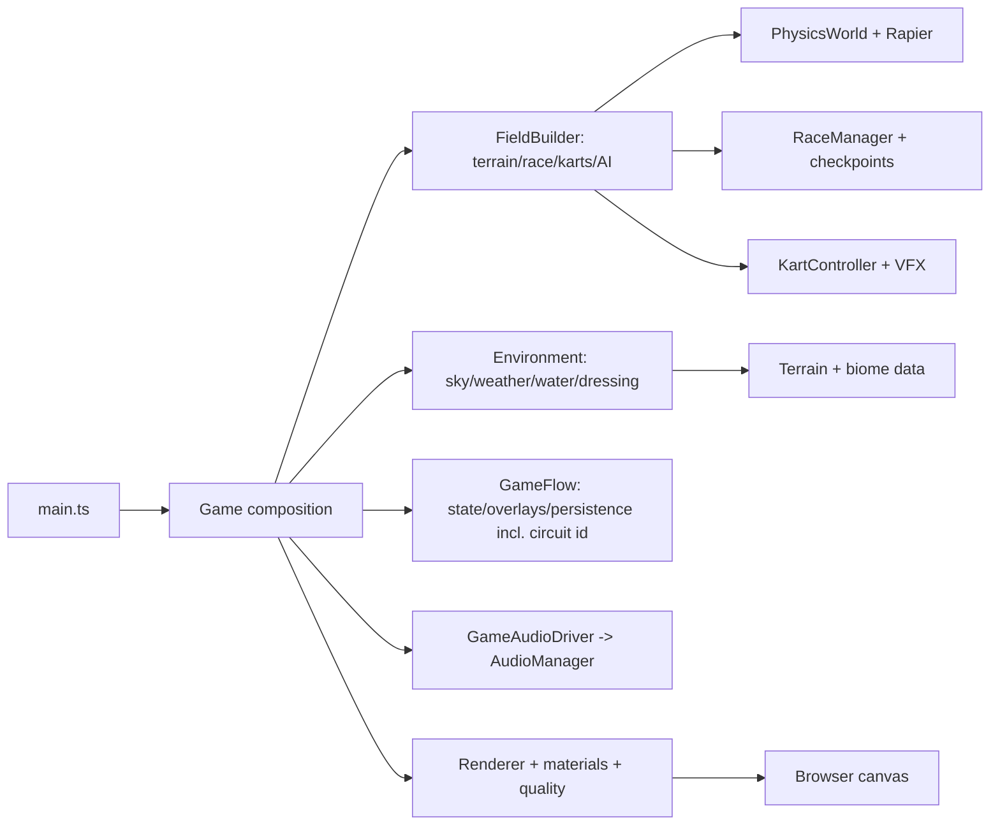
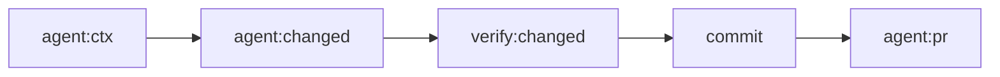

# Agent Guidelines

## Game Identity

This is a vibes-first exploration and adventure kart game with a grounded,
realistic art style ("Painted Wilds"). Mood and atmosphere are first-class —
real light, weather, and materials over arcade gloss or cartoon stylization.
Each biome has its own vibe; see `docs/knowledge/conventions/art-direction.md`.

## Directory Map

```text
./                       # game-cart root
├── .githook/            # local git hooks
│   └── pre-commit.d/    # hook checks
├── .github/             # GitHub automation
│   └── workflows/       # CI/deploy flows
├── docs/                # knowledge wiki + case logs
│   ├── knowledge/       # OKF v0.1 architecture wiki (single source of truth)
│   └── troubleshooting/ # case logs
├── src/                 # game source; see src/AGENTS.md
└── tools/               # agent, verify, lint, test config
```

## Runtime Flow



Component ownership and per-subsystem data flow live in `src/AGENTS.md` and
`docs/knowledge/data-flows/`.

## Doc Tree

- Every `AGENTS.md` has an annotated dir tree for dirs below it; stop at a
  child dir with its own `AGENTS.md` (child owns that subtree).
- Each dir with `AGENTS.md` has a `CLAUDE.md` symlink to it
  (`ln -s AGENTS.md CLAUDE.md`); never copy.
- Every `AGENTS.md` includes >= 1 Mermaid diagram (flow or state, not
  layout) and stays <= 200 LOC; split detail into a nested `AGENTS.md`
  before it grows. Enforced by `.githook/pre-commit.d/07-governance.sh`.
- Every nested `AGENTS.md` links its `@docs/knowledge/<dir>/index.md`.

## Agent Workflow



- Start each session with `npm run agent:ctx`; use that before broad discovery.
- Run `npm run agent:changed` before choosing checks.
- Use `npm run agent:state` when handoff/resume needs compact local state.
- Use `npm run agent:pr` for compact PR/check status when branch has PR.
- Use `npm run agent:handoff` before spawning subagents.
- Give subagents compact context plus exact scope.
- Subagents return only: files changed, commands run, failures/fixes, risks.
- Main agent owns final `npm run verify`, commit, push, PR.
- Do not paste raw logs into chat. Use capped output plus log path.
- Hook failures are blockers. Read concise error, fix root cause, rerun the
  smallest relevant command, retry.
- Runtime agent files live under ignored `.agent/`; commit helper code only.

## Dev/Agent Tooling

Gated behind a dev build or `?debug`; prod clean, captures runtime-only. Full
set (`window.__game.debugSnapshot()`, URL flags `?biome=&seed=&autostart`,
`?freefly` cam, `?garage` viewer, `npm run shoot`) in `docs/knowledge/dev/` +
`docs/knowledge/core/`.

Kart-model vision loop: `npm run shoot -- --garage --variant <id> --views
front,side,top,iso [--ref <photo>]` renders to-scale ortho front/side/top + iso
with a burned-in dimension overlay plus a `window.__garage.snapshot()`
measurements JSON under `.agent/shots/`. Read them, edit the model def
`src/kart/models/<id>.ts`, re-shoot, compare.

## Quality & Conventions

Enforce rules automatically where possible: hooks first, CI as backstop. For
what is not automated, prefer judgement and matching the surrounding code over
rigid rules. Full detail lives in two convention docs, loaded on demand:

- `docs/knowledge/conventions/quality-gate.md` — pre-commit hooks, `verify`
  modes, lint/format tooling, governance invariants, CI.
- `docs/knowledge/conventions/commit-style.md` — Conventional Commits format
  and git workflow (atomic commits, PR-only, rebase/squash).

Non-enforced policies worth keeping front of mind:

- Use procedural or code-native visuals/audio unless policy changes.
- Static deploy keeps relative asset paths for sub-path/preview hosting
  (Cloudflare Pages); Vite owns dev/build/preview, keep minimal.
- When editing, run `npm run verify:changed`; before push, `npm run verify:push`.

## Project Docs

- ALL project knowledge MUST be recorded in `docs/knowledge/`. It is the
  single source of truth for architecture, subsystem behavior, decisions,
  and conventions; nothing durable lives only in chat, commits, or PRs.
- There is no backlog/task-file system. Do not create `docs/backlog/`,
  `docs/todo.md`, or similar task trackers. Durable outcomes of work go
  into the matching `docs/knowledge/` concept.
- Every commit that changes `src/` MUST also touch a `docs/knowledge/*.md`
  file. Enforced by the `09-knowledge-freshness` pre-commit hook and a CI
  step; no bypass.
- Keep `docs/knowledge/` current with code: behavior, public API, ownership,
  lifecycle, data flow, or subsystem invariant changes update the matching
  OKF knowledge file in the same commit.
- `docs/knowledge/` follows [OKF v0.1][okf-spec]. Concept docs require
  frontmatter `type`, `title`, `description`, `tags`, and ISO-8601 UTC
  `timestamp`. `npm run lint:okf` enforces this plus source-path liveness
  (backtick `src/`/`test/` refs must exist) and rejects task-ID/PR refs.
- Knowledge docs are factual architecture notes, not task history. Prefer
  source-linked current behavior over task IDs, PR refs, or old plan text.
- Run `npm run lint:okf` after knowledge edits; use `npm run verify:changed`
  before commit.
- Troubleshooting needs case file in `docs/troubleshooting/<DATE>_<SUBJECT>.md`;
  append steps as work proceeds.

## Subsystem Invariants

Cross-cutting invariants are documented in `docs/knowledge/conventions/` and
`docs/knowledge/terrain/height-pipeline.md`.

Near-terrain surface detail (069) is shading-only: fbm albedo mottle +
micro-normal bump fold into the near CelMaterial fragment behind a
`SURFACE_DETAIL` define, tier-gated (low off). `heightAt`, the trimesh
collider, and suspension raycasts are untouched; mesh and collider verts
stay identical by construction. Off-path fragment source is byte-identical
to the pre-069 shader (no define, no uniforms).

Menu/overlay chrome (072) is biome-neutral editorial: kicker + serif
heading + hairline/telemetry/corner/vignette/grain from pure cssText
builders in `src/ui/menuStyles.ts`. No warm palette (that is 073's scene
only); focus outlines keep `MENU_ACCENT`. Builders stay DOM-free so jsdom
specs assert on strings.

## Writing Style

- Max info density, easy read. Abbrev common prose: DB, auth, config, req,
  res, fn, impl. Strip filler; fragments fine. `X -> Y` for causality.
  Keep code symbols, fn names, API names, error strings verbatim.
  Never use bold unless critical. Headings unnumbered. No emojis.

[okf-spec]: https://raw.githubusercontent.com/GoogleCloudPlatform/knowledge-catalog/refs/heads/main/okf/SPEC.md
