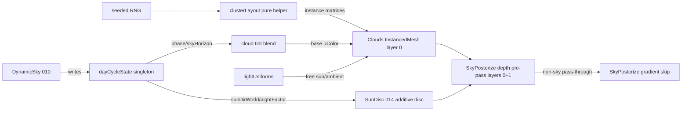

# 014 Clouds + sky decorations

Status: open (full plan — ready for execution)

## Context

002 deferred clouds (`002:75-79` "No clouds; future backlog") and owed a
sun-disc overlay sprite (`002:67-71` Architecture "Sun-disc fallback";
acceptance `[~]` — the synthetic gradient blend at uBandMix=0.7 mostly
obscures the natural Preetham sun spot). 002's smooth gradient sky reads
clean but empty; the 001 cel + painted-sky direction demands matching
stylized decor, not photoreal volumes.

The existing `environment/Clouds.ts` (004) is a minimal placeholder: 24
single-puff squashed-icosahedron InstancedMesh instances on layer 0 with
flat cel shading and +X drift+wrap. It works but reads as isolated blobs,
carries no day-cycle coupling, and has no sun-disc sibling.

010 (landed, pending-review) ALREADY owns stars + a moon disc
(`DynamicSky.ts:86-121`): both on layer 0, `renderOrder -1`, `fog:false`,
opacity driven by `nightFactor`, the moon mirroring the anti-sun. The
concept's "moon/stars deferred to 010" is therefore DONE — 014 does not
re-add them. 010 also drives the `dayCycleState` singleton at runtime, and
`Weather.ts:114-136` establishes the coupling pattern (read the singleton
in `update`; `Environment.update` cascades DynamicSky BEFORE clouds/weather
so fresh values are read — `Environment.ts:56-61`). This pays 014's
documented forward-dep cleanly.

## Goal

Stylized sky decor matching the 001 cel + 002 painted-sky look:

- Clouds: multi-puff cel clusters (painted-blob silhouettes, not photoreal
  volumes). Slow +X drift + wrap (infinite scroll). Tunable density +
  altitude. Soft rim via the existing CelMaterial rim term.
- Day-cycle cloud tint: cloud base tint tracks `dayCycleState`
  (dawn-pink / dusk-amber) on top of the free sun/ambient lighting CelMaterial
  already receives via shared `lightUniforms` (`cel.ts:133-140`).
- Sun-disc overlay: additive world-space disc tracking `sunDirWorld`,
  visible by day, fading at night — pays the 002 debt. Mirrors the 010 moon.

## Non-goals

- Volumetric / photoreal cloud rendering (clashes with cel direction).
- Time-of-day cycle + weather (010 owns; 014 consumes `dayCycleState`).
- Cloud shadows on ground/kart (cascade shadow work — belongs to 011).
- Procedural cloud simulation (fluid advection) — sculpted meshes only.
- Moon / stars — already owned by 010 (`DynamicSky.ts:86-121`).
- Birds / wildlife silhouettes — fold into 017 (ambient wildlife).
- Aerial particles (dust / leaves) — 010 weather + 017 wildlife own these.
- Moving clouds to render layer 2 (see Design Decision A — rejected).

## Dependencies

001 (CelMaterial + render layers). 002 (SkyPosterize depth-mask contract +
uSkyStart). 010 LANDED — drives `dayCycleState` (cloud tint + sun-disc
visibility input). 005 (optional soft wind cue — soft dep). 011 (draw-call
budget — single InstancedMesh keeps clouds at ~1 draw).

No gameplay deps. Clouds + sun-disc consume the existing layer-0 solid-decor
contract; they do not touch the sky-posterize mask.

## Design Decisions

Resolves the concept's "Needs refinement" + "Open questions".

### A. Clouds STAY on layer 0 — NOT layer 2 (REJECTED)

The concept proposed riding "the sky layer (layer 2)". Layer 2 is the
Preetham `Sky` DOME that SkyPosterize REPLACES: the depth pre-pass renders
only layers 0+1 (`nonSkyLayersMask = 0b011`, `skyPosterize.ts:149,262-274`),
so any object outside that mask reads as depth == 1.0 and is overwritten by
the synthetic gradient -> a layer-2 cloud would vanish behind its own sky
replacement.

Layer 0 (solid decor, same as the 010 moon/stars and props) is correct: the
depth pre-pass registers clouds -> depth < 1.0 -> SkyPosterize passes the
cloud pixel through untouched -> cloud keeps its cel tint. This is also what
gives clouds free day-cycle sun/ambient lighting via shared `lightUniforms`.
Sketch options (a)/(b)/(c) are closed: **keep layer 0**.

### B. Cloud representation = multi-puff clusters, single InstancedMesh

One cloud = K jittered puffs (default 6) arranged around a center; all
`clouds * puffsPerCloud` puffs live in ONE InstancedMesh (1 draw call, 011-
safe). Pure helper `clusterLayout(opts)` returns the instance matrices
(deterministic seeded; unit-testable like `propSampler`). Keeps the 004
squashed-icosahedron puff geometry + flat CelMaterial; the cluster gives the
painted-blob silhouette. Wrap stays group-level (+X, `Clouds.ts:69-72`).

### C. Cloud shading = CelMaterial (no custom cloud shader)

CelMaterial already supports `rimColor/rimPower/rimIntensity`
(`cel.ts:13-15,97-103`) and shares `lightUniforms` -> soft rim + day-cycle
sun/ambient are free. Translucency is approximated by the rim term + a light
base tint; a custom translucency shader is deferred (not needed for the cel
look). No inverted-hull outline on instanced draws (001 has no instance-matrix
outline path) — soft cel blobs remain the accepted fallback (004 precedent).

### D. Day-cycle coupling = read dayCycleState in update (mirrors Weather)

`Clouds.update(dt)` reads `dayCycleState` directly (same pattern as
`Weather.ts:2,114-136`) and lerps the cloud base tint toward dawn/dusk tints
derived from `dayCycleState.phase` / `skyHorizon`. Safe because 010 is live
and `Environment.update` runs DynamicSky before clouds. Exposes
`CloudsOptions.density/altitude/seed`. This closes the 014->010 forward-dep.

### E. Sun-disc = world-space additive disc mirroring the 010 moon

New `environment/SunDisc.ts`: `MeshBasicMaterial` (additive, transparent,
`fog:false`), layer 0, `renderOrder -1`, radius ~ moon's (40), positioned at
`dayCycleState.sunDirWorld * shell` (shell 1500, same as moon). Opacity =
`1 - nightFactor` (visible by day, gone at night — the inverse of the moon's
`nightFactor` fade). Owned by `Environment` so 010's `DynamicSky` (pending-
review) stays untouched. Pays the 002 "Sun-disc fallback" debt.

### F. Drift model = world-space plane + group wrap (unchanged)

Keep the 004 infinite-scroll wrap (`Clouds.ts:69-72`). No sky-dome-relative
placement (the world box already tracks the play area; clouds are decor, not
parallax).

## Architecture

## Implementation

Atomic commits, each leaving build + lint + tests green.

1. `feat(env): multi-puff cloud cluster layout` — add pure
   `clusterLayout(opts)` helper + rewrite `Clouds` to build one InstancedMesh
   of `clouds * puffsPerCloud` puffs. Update `Clouds.test.ts` count/geometry
   assertions. Keep layer 0, flat CelMaterial, +X wrap.
2. `feat(env): day-cycle cloud tint via dayCycleState` — `Clouds.update`
   reads `dayCycleState` + lerps base tint; add tint-blend pure helper +
   tests. Add `density/altitude` knobs to `CloudsOptions`.
3. `feat(env): SunDisc overlay tracking sunDirWorld` — new
   `environment/SunDisc.ts` (+ test); bundle into `Environment` (construct +
   `update` + `dispose`, after DynamicSky). Pays 002 sun-disc debt.
4. `test(env): cloud cluster + sun-disc + tint coverage` — finalize unit
   tests (determinism, layer, visibility factor, dispose idempotence).
5. `docs(backlog): refine 014 into full plan` — this file; move
   `docs/todo.md` 014 from "Concept sketches" to "Full plans"; mark `- [~]`.

## Tests

- `clusterLayout`: determinism (same seed -> identical matrices), purity,
  puff count = clouds \* puffsPerCloud, bounds within world box.
- `Clouds`: single InstancedMesh, layer 0, flat CelMaterial, no shadows,
  +X drift + wrap bounds, dispose idempotent (mirror `Clouds.test.ts`).
- Tint helper: dawn/dusk/day tint selection from phase; blend factor.
- `SunDisc`: layer 0, renderOrder -1, `fog:false`, additive material;
  opacity = 1 - nightFactor (day visible, night hidden); position along
  sunDirWorld; dispose idempotent.
- jsdom-safe (no WebGL) — assert shader source / material flags / matrices,
  per `src/AGENTS.md` test conventions.

## Acceptance

- Clouds render as multi-puff cel clusters, drift +X, wrap, keep their tint
  against the sky gradient (layer-0 depth-mask contract holds).
- Cloud base tint visibly shifts dawn/dusk vs noon.
- Sun-disc visible in the daytime sky along the sun direction; fades out at
  night; moon/stars (010) unaffected.
- Build + lint + typecheck + full test suite green; no file > 600 lines
  (Clouds stays well under; SunDisc small); lines <= 100 chars.
- `docs/todo.md` refinement status updated.

## Impact / Risk

- `Environment.ts` gains SunDisc construct/update/dispose (+~20 lines, well
  within budget). `Clouds.ts` rewritten but same public shape (group/update/
  dispose). `Game.ts` untouched (Environment owns the bundle; Game has
  headroom at 443/600 after 012). No gameplay, physics, or audio changes.
- Risk: cluster puff count vs 011 draw/FPS budget — mitigated by single
  InstancedMesh; default density conservative, tunable. Visual verify (no
  black screen, tint shift, sun-disc placement) deferred to a dev-server pass
  -> `docs/troubleshooting/2026-06-XX_014-sky-decor-verify.md`.
