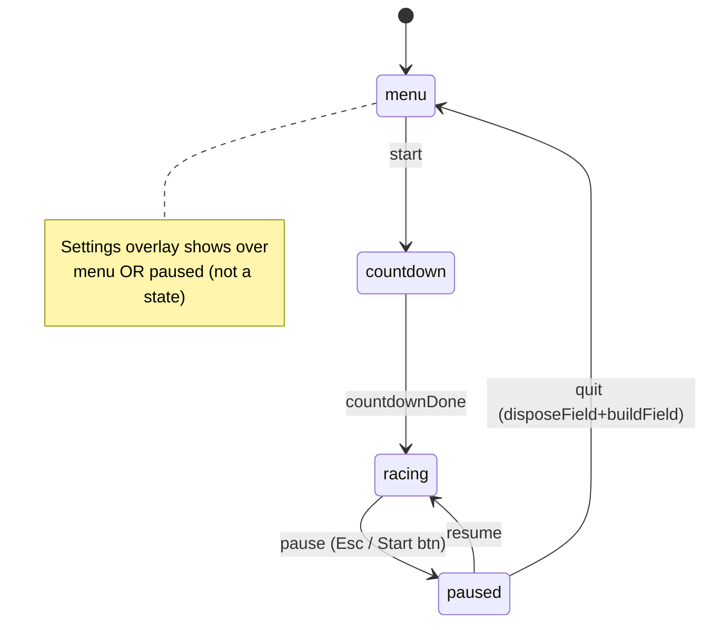

# 012 Menu: pause, settings (v1)

Status: pending-review (implemented)

## Context

006 ships a start screen + countdown + a pure 3-state machine
(`menu|countdown|racing`, `src/core/gameState.ts:13-30`). `racing` is terminal
(`gameState.ts:27-28`); no pause, no finish->menu path, no settings, no
persistence (`grep localStorage` across `src/` -> no matches). 006's deferred
list (`012` concept): pause/settings, track/kart select, gamepad menu nav,
camera blend, i18n, credits.

This refinement narrows 012 to front-end pieces whose deps are satisfied
today: PAUSE + SETTINGS v1. Select needs multi-track plumbing (parameterize
`SplineTrack` control points + retune ~6 hardcoded Game constants) plus a
kart cosmetic+tuning param -> SPLIT to new concept stub 020. Quality tier has
no sink until 011 lands `Renderer.setQuality` + `quality.ts` (`011:93-98,177`;
011 open/unimplemented) -> BLOCK on 011. Keybind remap needs moving
`PLAYER_BINDINGS` (`Input.ts:21-38`) to instance state + a capture UI -> defer
to a settings-v2 note.

Real constraints, resolved against the code:

- Pause plug-in is small + clean. Physics gate is one clause (`Game.ts:262`
  `if (this.state !== "menu")` -> also skip `paused`); render branch
  (`Game.ts:282` `if (racing)` -> `if (racing || paused)`) keeps the frozen
  chase view visible under a dim overlay. Input already zeroes when not
  `driving` (`Game.ts:257,260`). Audio suspend exists (`AudioManager.suspend`
  `:357-359`).
- Settings sinks exist: `setVolume`/`mute` (`AudioManager.ts:345-354`) store
  the field pre-resume and apply on `resume()` via `applyMaster`
  (`:529-533`, guards on ctx). Boot-time settings apply on the Start gesture.
  [WARNING] NO music/sfx split today: every voice feeds `master` directly
  (engine/drift/wind, collision `:485`, uiBeep `:294`); music feeds its own
  `bus` -> `master` (`musicBed.ts:121-123`, `AudioManager.ts:501`). A balance
  slider needs new `sfxBus`+`musicBus` gains before `master` -> own commit.
- `Game.ts` is 600/600 (hard cap). Pause+settings wiring is ~25-30 net lines.
  Per decision, a pure REFACTOR commit first extracts field lifecycle + AI
  step into `FieldBuilder` (mirrors `GameAudioDriver`/`PlayerView` extraction
  precedent) to free headroom. Net-zero behavior.
- DOM overlay pattern is consistent (`src/ui/`): each class owns nodes, inline
  `cssText`, `z-index:10`, `pointer-events:none` root + `auto` on buttons, a
  minimal `MenuAudio` iface for stubbable beeps, `show/hide/remove`
  (`StartMenu.ts:128-226`). Pause/Settings overlays reuse this exactly.
- Gamepad menu nav has NOTHING to reuse: `Input` is kart-only
  (`Input.ts:42-117`), module-level bindings; `StartMenu` only listens to
  window `Enter`/`Space` + mouse (`StartMenu.ts:155-182`). Build a shared
  `menuNav` edge-emitter (arrows + D-pad/stick + Enter/Back) overlays opt into.
- Multi-track is config-driven at the spline (`SplineTrack(control,samples)`
  `SplineTrack.ts:56-59`; `TerrainOptions.control` `Terrain.ts:30-31`) but
  Game hardcodes circuit geometry: `AI_AHEAD_STEP` `Game.ts:42`,
  `CORRIDOR_HALF_WIDTH` `:44`, `RESPAWN_AHEAD_T` `:43`, `MENU_CAM_*`
  `:33-35`, shadow ortho `Renderer.ts:130`, fog `Renderer.ts:99`. A 2nd
  circuit retunes these -> real work, lives in 020.

## Goal

- Pause: new `paused` state (racing<->paused), freezes physics + kart input,
  keeps the live chase render under a dimmed overlay; Resume + Settings + Quit.
  Quit tears the field down + rebuilds + returns to `menu`. Audio suspends on
  pause, resumes on resume.
- Settings v1: master volume, mute, music volume, sfx volume (needs new music
  - sfx bus gains). Live-apply on change. Reachable from StartMenu and
    PauseOverlay. Persisted (localStorage, versioned schema).
- Gamepad + keyboard nav across StartMenu, PauseOverlay, SettingsOverlay
  (D-pad/stick + arrows traverse; confirm/back).
- Game.ts refactor: extract field build/dispose + AI step into `FieldBuilder`
  to recover headroom (pure refactor, own commit, net-zero behavior).

## Non-goals

- Track + kart select -> new stub 020 (needs multi-track + kart param).
- Quality tier setting -> 011 (no sink until `Renderer.setQuality` lands).
- Keybind remap -> settings v2 (Input instance-state + capture UI).
- Camera blend menu->race (snap stays; 006 acceptance unchanged).
- i18n + credits + replay theater (defer; unchanged from concept).
- Cloud save / online profile (local only).

## Architecture (new)

```text
src/core/
  gameState.ts       # MODIFY: add "paused" + pause/resume/quit events +
                     #   transitions + tests. Still pure, jsdom-safe.
  FieldBuilder.ts    # NEW (refactor): owns views/rivals/race/huds/ai state +
                     #   build/dispose/stepWorld/AI tick. Game delegates.
                     #   Net-zero behavior; frees Game headroom.
  settings.ts        # NEW PURE: SettingsState type, DEFAULTS, validate +
                     #   normalize. Exported for jsdom tests.
  storage.ts         # NEW: versioned load/save to localStorage (try/catch,
                     #   no-op if unavailable). Schema {version, settings}.
src/audio/
  AudioManager.ts    # MODIFY: add sfxBus + musicBus gains before master;
                     #   reroute engine/drift/wind/collision/uiBeep -> sfxBus,
                     #   musicBed -> musicBus. setMusicVolume/setSfxVolume
                     #   (store pre-resume, apply on resume). 542 -> ~575.
src/ui/
  PauseOverlay.ts    # NEW: dim backdrop + Resume/Settings/Quit; callback
                     #   model; MenuAudio beeps; show/hide/remove.
  SettingsOverlay.ts # NEW: master/music/sfx range sliders + mute + Back;
                     #   live-apply callbacks; show/hide/remove.
  menuNav.ts         # NEW PURE: edge-emitter (up/down/left/right/confirm/
                     #   back) from arrows + gamepad D-pad/stick; hysteresis.
src/core/
  Game.ts            # MODIFY (post-refactor, headroom free): loop guard +
                     #   render branch for paused; onPause/onResume/onQuit;
                     #   Esc listener; Settings buttons on StartMenu/Pause;
                     #   boot-time settings apply. Stays < 600.
src/main.ts          # MODIFY: load settings pre-start; apply to audio after
                     #   new Game; pass into SettingsOverlay.
```

State machine after:



## Contracts with 001-010

- 001/002/010: none (render + sky/weather untouched; paused still renders the
  chase view, just skips the physics step).
- 003: none (terrain + collider untouched; quit->menu rebuilds the field via
  the same buildField/disposeField path `onStart` uses `Game.ts:455-458`).
- 004/007/008/009: none (field/AI/HUDs/audio-impact paths unchanged; pause
  only suspends ctx + zeroes input; FieldBuilder is a pure relocation).
- 005: audio balance adds bus gains but keeps the no-op-before-resume +
  gesture-guard invariants (`src/AGENTS.md`); setVolume/mute semantics
  unchanged on master.
- 006: StartMenu gains a Settings button + gamepad nav; countdown + state
  machine extended (legal combos still return input state unchanged
  `gameState.ts:19-20`); pause mirrors `onStart`/`onCountdownDone`
  (`Game.ts:453-473`).

## Commits (each atomic + green; gate = typecheck + lint + vitest + hook)

1. `refactor(core): extract field lifecycle + AI step into FieldBuilder`
   - Move buildField/disposeField/stepWorld + AI helpers (sampleAhead,
     rivalPositions, tickStuck, respawnAhead, racePose) into
     `src/core/FieldBuilder.ts`; Game holds a FieldBuilder + delegates.
   - Net-zero behavior; existing Game.test.ts stays green. Frees ~150-200
     Game lines of headroom.
2. `feat(core): paused state machine transitions`
   - gameState: add `"paused"`, events `pause|resume|quit`; transitions
     racing<->paused, paused->menu. Illegal combos unchanged. Tests.
3. `feat(ui): PauseOverlay + Game pause wiring`
   - PauseOverlay (dim backdrop, Resume/Settings/Quit, beeps, remove).
   - Game: loop guard skips paused (`:262`), render branch renders views when
     paused (`:282`), onPause/onResume/onQuit (suspend/resume audio,
     disposeField+buildField on quit, show/hide overlays + HUDs), Esc toggle
     (racing only). Tests.
4. `feat(audio): music + sfx bus gains for balance`
   - AudioManager: sfxBus + musicBus before master; reroute voices/wind/
     collision/uiBeep -> sfxBus, musicBed -> musicBus; setMusicVolume/
     setSfxVolume (pre-resume-safe). Update routing tests. Verify no audio
     regression (1P + 2P).
5. `feat(core): settings state + versioned localStorage`
   - `settings.ts` (type, DEFAULTS, validate/normalize) + `storage.ts`
     (versioned load/save, try/catch). Pure + jsdom tests.
6. `feat(ui): SettingsOverlay + live apply + boot load`
   - SettingsOverlay (sliders + mute + Back, live-apply callbacks, beeps,
     remove). Wire Settings buttons into StartMenu + PauseOverlay. main.ts
     loads settings pre-start + applies to audio. Tests.
7. `feat(ui): gamepad + keyboard menu navigation`
   - `menuNav.ts` edge-emitter; opt-in on StartMenu, PauseOverlay,
     SettingsOverlay (traverse + confirm + back). Tests.
8. `docs: refine 012 plan + split 020 select + todo`
   - Refine this file; create `open/020_track-kart-select.md` concept stub
     (retired select scope + multi-track/kart-param notes); update
     `docs/todo.md` (012 refined, 020 concept; deps: quality->011,
     select->020); troubleshooting verify note.

## Risks

- Game.ts 600/600: the refactor (commit 1) MUST be net-zero behavior and land
  first; pause/settings wiring then stays under cap. If FieldBuilder
  extraction leaks behavior, gate on Game.test.ts parity before proceeding.
- Audio bus reroute (commit 4) changes node graph -> existing routing tests
  may assert old destinations. Update tests; re-verify 1P/2P audibly (engine,
  drift, wind, impact, music, uiBeep all still sound; balance sliders move
  only their bus). setMusicVolume/setSfxVolume must be no-op pre-resume like
  setVolume (store field, apply on resume via applyBuses).
- Quit->menu rebuilds the field mid-session: reuse the exact disposeField+
  buildField pair from `onStart` (`Game.ts:455-458`); reset state, results
  overlay, HUDs; avoid double-dispose. Verify no Rapier/Three leak (body +
  geometry counts stable across quit cycles).
- Pause during 2P: both viewports keep rendering (render branch already loops
  views `:286-288`); confirm both chase cams stay framed while frozen.
- Gamepad nav edge-emission: D-pad + axis need debounce/hysteresis or a held
  stick repeats; mirror `AXIS_DEADZONE` (`Input.ts:40`) + an edge guard.
- Esc conflict: Esc is not a game key today (`Input.ts:21-38`), but ensure
  the pause listener is active only in racing/paused and removed on dispose.
- Settings sliders vs gamepad: range inputs need keyboard/gamepad step
  (arrow left/right -> +/- .1). Verify a11y (focusable, labeled).

## Acceptance

- [ ] FieldBuilder refactor: net-zero behavior; Game.test.ts green; Game < 600
- [ ] `paused` transitions pure + tested; illegal combos unchanged
- [ ] Pause: Esc/Start toggles racing<->paused; physics + input freeze, chase
      view stays visible under dim overlay; audio suspends/resumes; Quit ->
      field rebuild + menu; no leak across quit cycles
- [ ] music + sfx bus gains; setMusicVolume/setSfxVolume pre-resume-safe;
      balance sliders move only their bus; no audio regression 1P/2P
- [ ] settings.ts + storage.ts pure + tested; versioned schema; no-op w/o DOM
- [ ] SettingsOverlay: master/music/sfx + mute, live apply + persist;
      reachable from StartMenu + Pause; loads + applies at boot
- [ ] menuNav: gamepad + keyboard traverse all three screens + confirm/back
- [ ] `npm run typecheck && lint && test` green; pre-commit hook green
- [ ] No black screen at `npm run dev`; verify note in `docs/troubleshooting/`

## Defaults

- settings v1: { masterVolume: 0.8 (DEFAULT_VOLUME `AudioManager.ts:97`),
  muted: false, musicVolume: 0.8, sfxVolume: 1.0 }. validate clamps [0,1].
- storage schema: { version: 1, settings: SettingsState }. Unknown version ->
  discard + return DEFAULTS (no crash on corrupt/missing).
- pause overlay: dim backdrop rgba(0,0,0,0.55), z-index 10 (matches
  StartMenu/Countdown `StartMenu.ts:47-48`); buttons reuse START_STYLE cue.
- bus gains default 1.0 so current mix is unchanged at default settings.
- menuNav: axis deadzone 0.18 (`Input.ts:40`); repeat guard ~250 ms on hold.

## Previous implementation

None. Closest patterns: StartMenu/Countdown/RaceHud DOM + remove()
(`src/ui/`); `MenuAudio` stub interface (`StartMenu.ts:18-20`); state machine
pure-fn (`gameState.ts`); AudioManager master/applyMaster (`:345-354,529-533`)

- musicBed internal bus (`musicBed.ts:121-123`); GameAudioDriver/PlayerView
  extraction to keep Game under cap (`src/audio/gameAudio.ts`,
  `src/core/PlayerView.ts`).

## Depends on

000 (harness; test gate live). 005 (volume/mute/suspend + new bus gains).
006 (state machine, StartMenu/Countdown DOM pattern, `src/ui/`). BLOCKS on 011
for the quality-tier setting (no sink until `Renderer.setQuality` +
`quality.ts`); 011 is open/unimplemented. Track + kart select SPLIT to 020
(needs multi-track plumbing + kart cosmetic/tuning param).

## Implementation (pending-review)

Landed in 8 atomic commits (typecheck + lint + vitest green on each; hook
gate green). 585 -> 687 tests (+102).

- `refactor(core): extract field lifecycle + AI step into FieldBuilder` —
  net-zero relocation of build/dispose/stepWorld + AI helpers out of Game
  (600 -> 345 lines) into new `core/FieldBuilder.ts` (352). Frees headroom.
- `feat(core): paused state machine transitions` — `gameState` gains
  `paused` + `pause|resume|quit`; racing<->paused, paused->menu, illegal
  no-op. Pure + tested.
- `feat(ui): PauseOverlay + Game pause wiring` — new `ui/PauseOverlay.ts`
  (dim backdrop, Resume/Settings/Quit). Loop freezes physics/input when
  paused but keeps rendering the frozen chase view; Esc toggles; audio
  suspends/resumes; Quit rebuilds the field + returns to menu.
- `feat(audio): music + sfx bus gains for balance` — AudioManager gains
  sfxBus + musicBus before master (default 1.0); all SFX -> sfxBus, music
  -> musicBus; setSfxVolume/setMusicVolume (pre-resume-safe). Routing
  tests updated to the new graph.
- `feat(core): settings state + versioned localStorage` — pure
  `core/settings.ts` (SettingsState, DEFAULTS, validateSettings) +
  `core/storage.ts` (versioned, never-throws load/save).
- `feat(ui): SettingsOverlay + live apply + boot load` — new
  `ui/SettingsOverlay.ts` (master/music/sfx sliders + mute + Back,
  live-apply). Game owns settings: boot load + apply, open from StartMenu
  and Pause, validate->apply->save on change, Esc closes settings.
- `feat(ui): gamepad + keyboard menu navigation` — new `ui/menuNav.ts`
  (pure digestGamepad edge-detector + MenuNav class); opted into all three
  overlays. Keyboard arrows traverse; gamepad D-pad/stick/A/B full nav.
- `docs:` AGENTS.md runtime-flow refreshes + this refine.

Deviations from the plan (review notes):

- Game owns the settings state + overlay (boot load + apply in its ctor),
  NOT main.ts. src/AGENTS.md says "main.ts only bootstraps Rapier and
  creates Game"; Game had headroom post-FieldBuilder, so this keeps
  settings cohesive with the audio/overlays Game already owns. The plan's
  "main.ts MODIFY" step was therefore not needed.
- `Game.respawnAhead` is public (net-zero FieldBuilder refactor needed it:
  Game.test.ts drives it via cast after stepWorld moved).
- jsdom in this Node combo has no `localStorage`; storage tests stub an
  in-memory shim. storage.ts stays defensive (globalThis.localStorage?.).

Verify: dev server loads to the menu (no black screen, no console errors);
SETTINGS opens the overlay (3 sliders + mute) and hides the start menu;
render loop active (frame counter advances), real GL context. See
`docs/troubleshooting/2026-06-25_012-menu-pause-settings-verify.md`. Live
gamepad + audible balance-slider + quit-cycle leak checks deferred to the
review pass.

Non-goals unchanged: track/kart select -> 020; quality-tier setting -> 011
(now landed, so a settings-v2 quality toggle is unblocked); keybind remap ->
settings v2.
