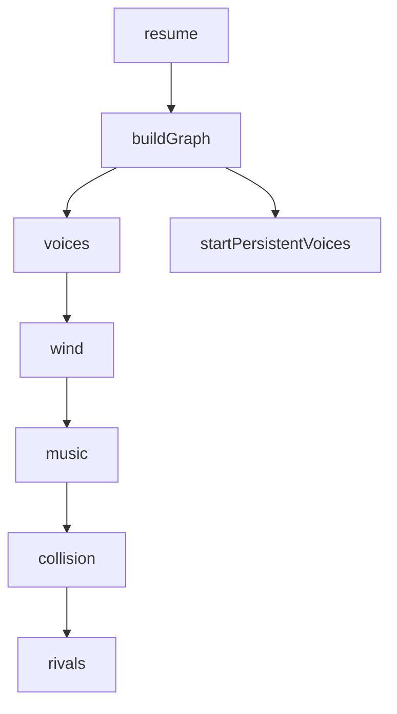

# Schema

Builds the Web Audio node graph. Builders take `(ctx, buses, opts)`
and return node handles; they hold NO AudioManager state.

**Load-bearing creation order** (mock tests assert indices):

1. `resume()` calls `buildGraph()` then `startPersistentVoices()`
2. Internal build order: **voices → wind → music → collision → rivals**
3. This order MUST stay stable — downstream tests assert node indices match this sequence.



# Examples

```ts
// audioGraph.ts — builder sketch
interface GraphBuilders {
  buildVoices(ctx: AudioContext, buses: Buses, opts: BuildOpts): VoiceNodes;
  buildWind(ctx: AudioContext, buses: Buses, opts: BuildOpts): WindNodes;
  buildMusic(ctx: AudioContext, buses: Buses, opts: BuildOpts): MusicNodes;
  buildCollision(ctx: AudioContext, buses: Buses, opts: BuildOpts): CollisionNodes;
  buildRivals(ctx: AudioContext, buses: Buses, opts: BuildOpts): RivalNodes;
}
```

# Citations

- [AudioManager](/audio/audio-manager.md)
- [Audio Lifecycle](/data-flows/audio-lifecycle.md)
