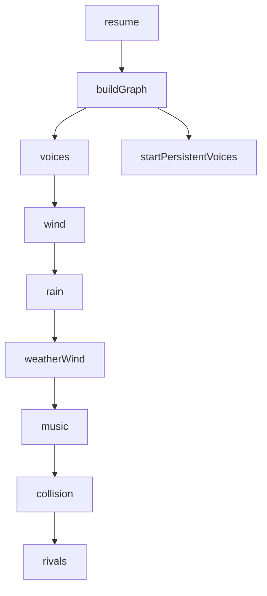

# Schema

Builds the Web Audio node graph. Builders take `(ctx, buses, opts)`
and return node handles; they hold NO AudioManager state.

**Load-bearing creation order** (mock tests assert indices):

1. `resume()` calls `buildGraph()` then `startPersistentVoices()`
2. Internal build order:
   **voices → wind → rain → weatherWind → music → collision → rivals**
3. This order MUST stay stable — downstream tests assert node indices match this sequence.



`buildGraph(ctx)` creates the bus architecture:

- `master` → `compressor` (threshold -24, ratio 4, knee 30) → `ctx.destination`
- `sfxBus` and `musicBus` feed `master`

# Examples

```ts
// audioGraph.ts — builder sketch
function buildGraph(ctx: AudioContext): GraphBuses;
// Returns { master, compressor, sfxBus, musicBus }
// compressor: threshold -24, ratio 4, knee 30

function buildWind(ctx: AudioContext, noise: AudioBuffer, sfxBus: GainNode, dw: number): WindVoice;
function buildMusic(ctx: AudioContext, musicBus: GainNode, music: MusicOptions): MusicEngine;
function buildCollision(
  ctx: AudioContext,
  sfxBus: GainNode,
  noise: AudioBuffer,
  impact: ImpactVoice,
): void;
// Voices and rivals are constructed inline in startPersistentVoices()
```

# Citations

- [AudioManager](/audio/audio-manager.md)
- [Audio Lifecycle](/data-flows/audio-lifecycle.md)
