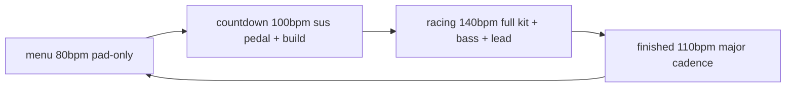

# Schema

`musicEngine.ts` replaces the original detuned-pad + arp bed with a
Tone.js-driven adaptive score. One `MusicEngine` per `AudioManager`, built at
voice position #4 (`voices → wind → rain → music → collision → rivals`).

- **Single AudioContext**: Tone shares this AudioManager's context via
  `setContext(ctx)` inside the engine constructor (only on the supported path).
  No second AudioContext is created.
- **Routing**: every synth connects into a Tone `Gain` engine bus that feeds
  the caller-supplied `musicBus` (NOT `ctx.destination`), so the
  music-volume slider, mute, and master compressor all still apply.
- **Transport**: Tone's `getTransport()` owns scheduling. `setPhase(phase)`
  disposes the active Sequences/Patterns, ramps each voice gain + the BPM, and
  builds the phase's patterns. Generative lead/bass use Tone `Pattern`
  combinators over literal note pools.
- **Chord scheduling invariant**: the pad `Sequence` is fed flat index events,
  NOT the chord arrays. Tone `Sequence` subdivides nested arrays — passing each
  note STRING to the callback — so a chord passed as `["A3","C4","E4"]` would
  never reach an `Array.isArray` gate and the pad stays silent. Indices fire
  once per subdivision; the callback looks up the full chord. The constructor
  calls `applyGains` (not bare `buildPhase`) so the initial menu pad gain ramps
  from its 0 init to the phase target (otherwise `setPhase("menu")` later
  early-returns and the menu bed is silent).
- **Voices**: `PolySynth(AMSynth)` chord pad (→ Reverb), `MonoSynth` bass,
  `MonoSynth` lead (→ FeedbackDelay), `MembraneSynth` kick, `NoiseSynth`
  snare, `MetalSynth` hat.
- **Graceful degrade**: `supportsTone(ctx)` probes `createConstantSource`
  (present on real AudioContext, absent on the jsdom mock). When false the
  engine builds ZERO native nodes and all methods no-op, keeping the
  load-bearing voice node indices stable. A constructor try/catch also degrades
  on any real-but-unsupported context so the game stays playable.

## Phase map (A minor)



| Phase     | Pad           | Bass    | Lead       | Drums          | BPM |
| --------- | ------------- | ------- | ---------- | -------------- | --- |
| menu      | Am-F-C-G 4bar | -       | -          | -              | 80  |
| countdown | Am7sus pedal  | root    | -          | hat+kick       | 100 |
| racing    | Am-F-C-G 1bar | offbeat | pentatonic | kick+snare+hat | 140 |
| finished  | C-F-G-C major | root    | fanfare    | kick           | 110 |

# Examples

```ts
// audioGraph.ts — music is voice #4, fed into musicBus
const musicEngine = buildMusic(ctx, musicBus, opts.music);
// AudioManager.setMusicPhase -> musicEngine.setPhase(phase)
// GameAudioDriver.flush observes game/race state and calls setMusicPhase
// only on a transition.
```

Pure exports: `musicPhaseFor(gameState, racePhase)` (used by `gameAudio.ts`),
`PHASE_CONFIG` (per-phase note arrays + gains, asserted by the engine test),
`MusicOptions` / `DEFAULT_MUSIC`.

# Citations

- [AudioManager](/audio/audio-manager.md)
- [AudioGraph](/audio/audio-graph.md)
- [Audio Lifecycle](/data-flows/audio-lifecycle.md)
