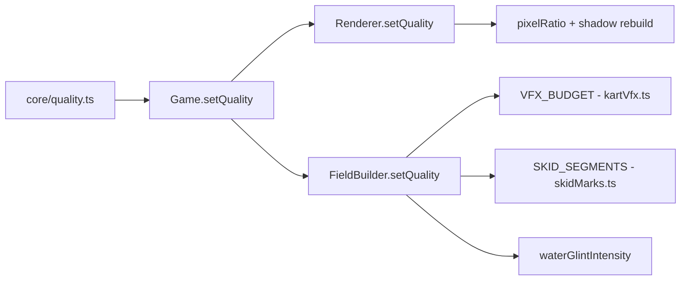

# Quality Propagation

How a `QualityTier` change ripples from the pure knob factory through every
graphics and simulation subsystem.



## Schema

`core/quality.ts` defines:

```ts
type QualityTier = "low" | "med" | "high";
const DEFAULT_QUALITY: QualityTier = "high";

interface QualityKnobs {
  pixelRatio: number;
  shadowMapSize: number;
  shadowCameraFar: number;
  shadowHalfExtent: number;
  vfxParticleBudget: number;
  skidSegments: number;
  waterGlintIntensity: number;
}
```

`qualityKnobs(tier, dpr)` returns frozen knobs per tier. `tier` throws on
unknown values. `dpr` is passed in (not read from window) so the function
stays pure + jsdom-testable.

## Propagation

### Stage 1: Game.setQuality(tier)

Entry point. Stores tier, calls through to Renderer and FieldBuilder.

### Stage 2: Renderer.setQuality(tier)

Reads `qualityKnobs(tier, devicePixelRatio)`. Applies `renderer.setPixelRatio`
and rebuilds the shadow map (new RT, new shadow camera far/half settings).
Triggers on next `render()`.

### Stage 3: FieldBuilder.setQuality(tier)

Reads `qualityKnobs(tier, ...)` and forwards budget/segment/glint values to
VFX and skid-mark subsystems. These budgets resize ring buffers; a tier
change during a race triggers buffer reallocation.

## Domain Sync

Domain modules export matching constants, kept in sync with
`qualityKnobs` by comment:

| Core export         | Domain copy     | Module              |
| ------------------- | --------------- | ------------------- |
| `vfxParticleBudget` | `VFX_BUDGET`    | `kart/kartVfx.ts`   |
| `skidSegments`      | `SKID_SEGMENTS` | `kart/skidMarks.ts` |

This decouples GL-owning modules from `core/` imports — each domain module
owns its budget constant independently. The sync comment in each file is
the contract.

## Tiers

| Tier | pixelRatio  | shadow | VFX  | Skid | glint |
| ---- | ----------- | ------ | ---- | ---- | ----- |
| low  | 1           | 1024   | 512  | 256  | 0     |
| med  | 1.5         | 2048   | 1536 | 512  | 1     |
| high | min(dpr, 2) | 2048   | 3072 | 1024 | 1     |

## Citations

- [Quality](/core/quality.md)
- [Renderer](/core/renderer.md)
- [VFX](/kart/vfx.md)
- [SkidMarks](/kart/skid-marks.md)
