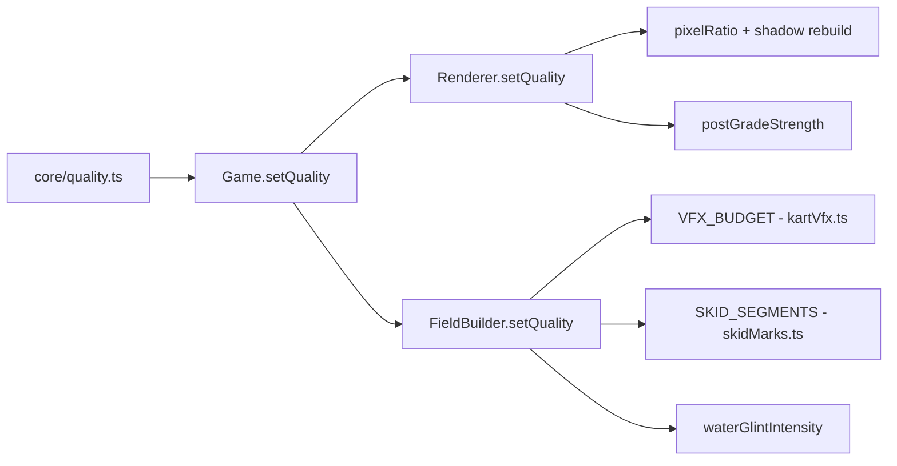

# Quality Propagation

How a `QualityTier` change ripples from the pure knob factory through every
graphics and simulation subsystem.



## Schema

`core/quality.ts` defines:

```ts
type QualityTier = "low" | "med" | "high";
const DEFAULT_QUALITY: QualityTier = "high";

interface QualityKnobs {
  pixelRatio: number;
  shadowMapSize: number;
  shadowCameraFar: number;
  shadowHalfExtent: number;
  vfxParticleBudget: number;
  skidSegments: number;
  waterGlintIntensity: number;
  postGradeStrength: number;
  // Draw-distance / LOD budgets (see /core/quality.md).
  terrainDrawCap: number;
  terrainSeedBudget: number;
  terrainCrossFadeSeconds: number;
  dressingDensityMin: number;
}
```

`qualityKnobs(tier, dpr)` returns frozen knobs per tier. `tier` throws on
unknown values. `dpr` is passed in (not read from window) so the function
stays pure + jsdom-testable.

## Propagation

### Stage 1: Game.setQuality(tier)

Entry point. Stores tier (`qualityTier`), calls through to Renderer,
FieldBuilder, and Environment.

### Stage 1b: Game.buildWorld (draw-distance / LOD budgets)

Unlike the live subsystems, the draw-distance / streaming budgets
(`terrainDrawCap`, `terrainSeedBudget`, `terrainCrossFadeSeconds`,
`dressingDensityMin`) are read from `qualityKnobs(qualityTier, dpr)` at world
(re)build time and forwarded to `Terrain` (stream/cull radius clamp, seed
budget, cross-fade) and the dressing config (density floor). A `setQuality`
mid-race changes them only on the next rebuild (menu-time), which is when
re-seeding a world is cheap. See [Quality](/core/quality.md).

### Stage 2: Renderer.setQuality(tier)

Reads `qualityKnobs(tier, devicePixelRatio)`. Applies `renderer.setPixelRatio`
and rebuilds the shadow map (new RT, new shadow camera far/half settings), then
forwards `postGradeStrength` to the final sky-posterize/color-grade pass.
Triggers on next `render()`.

### Stage 3: FieldBuilder.setQuality(tier)

Forwards the tier to terrain chunks, VFX, and skid-mark subsystems. Terrain
chunks rebuild and rebind their shared near material because detail octaves
are a compile constant; mesh/collider geometry stays intact. VFX/skid budgets
resize ring buffers, so a tier change during a race triggers reallocation.

## Domain Sync

Domain modules export matching constants, kept in sync with
`qualityKnobs` by comment:

| Core export         | Domain copy     | Module              |
| ------------------- | --------------- | ------------------- |
| `vfxParticleBudget` | `VFX_BUDGET`    | `kart/kartVfx.ts`   |
| `skidSegments`      | `SKID_SEGMENTS` | `kart/skidMarks.ts` |

This decouples GL-owning modules from `core/` imports — each domain module
owns its budget constant independently. The sync comment in each file is
the contract.

## Tiers

| Tier | pixelRatio  | shadow | VFX  | Skid | glint | postGrade |
| ---- | ----------- | ------ | ---- | ---- | ----- | --------- |
| low  | 1           | 1024   | 512  | 256  | 0     | 1         |
| med  | 1.5         | 2048   | 1536 | 512  | 1     | 1         |
| high | min(dpr, 2) | 2048   | 3072 | 1024 | 1     | 1         |

Draw-distance / LOD budgets (drawCap / seedBudget / crossFade / densityMin):

| Tier | drawCap | seedBudget | crossFade | densityMin |
| ---- | ------- | ---------- | --------- | ---------- |
| low  | 200     | 8          | 0         | 0.25       |
| med  | 280     | 12         | 0.4       | 0.30       |
| high | 360     | 16         | 0.4       | 0.35       |

## Citations

- [Quality](/core/quality.md)
- [Renderer](/core/renderer.md)
- [VFX](/kart/vfx.md)
- [SkidMarks](/kart/skid-marks.md)
