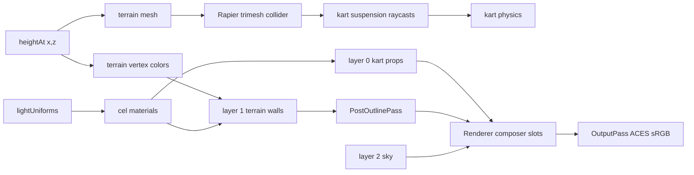

# Rendering Pipeline

Layers are defined in the [render-layers convention](/conventions/render-layers.md).
Shared lighting originates from [lightUniforms](/materials/cel-material.md).
The pipeline is owned by [Renderer](/core/renderer.md).
