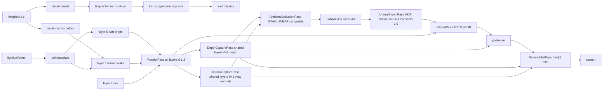

# Rendering Pipeline

The single `RenderPass` renders all scene layers (0, 1, 2) at once into a
HalfFloat LINEAR buffer. Layers are on scene objects via `.layers.set(N)`.
Camera enables layers 1 and 2 explicitly: `camera.layers.enable(1)`;
`camera.layers.enable(2)`.

Pass order per composer slot: `RenderPass` -> `DepthCapturePass` ->
`NormalCapturePass` -> `AmbientOcclusionPass` -> `SMAAPass` ->
`UnrealBloomPass` -> `OutputPass` -> `SkyPosterizePass` -> `GroundMistPass`.
The GTAO pass composites in LINEAR (before `OutputPass`) so the occlusion
multiply is physically motivated and halo-free. `UnrealBloomPass` (#231) also
runs on the LINEAR pre-tonemap buffer with a 1.0 threshold, so only genuine

> 1.0 emitters bloom (the HDR sun disc `src/environment/SunDisc.ts`; snow glints
> in `src/materials/snowCover.ts`); ordinary lit colors stay <1.0 and are
> untouched. It is tier-gated (low absent / byte-identical, med strength 0.35 at
> half-res, high 0.5 at full-res) and user-toggleable via the Settings
> `effects.bloom` flag. Every other composite pass runs post-tonemap in sRGB.

`SMAAPass` (232) is the last LINEAR op before `OutputPass`, placed right after
GTAO: three.js's `SMAAPass` requires LINEAR sRGB and must run before
`OutputPass`. It is gated by the `smaa` quality knob via `pass.enabled`
(EffectComposer skips disabled passes) in the per-slot composer
(`src/core/Renderer.ts`). The WebGL context `antialias:true` MSAA is a no-op
through the EffectComposer (scene renders to render targets), so SMAA is the
pipeline's only edge AA.

`SkyPosterizePass` runs after OutputPass (post-tonemap sRGB). The sky gradient
is a function of WORLD view direction, not screen position: a camera-relative
`uInvViewProj` (mat4, written from the camera via
`SkyPosterizePass.setView` in `Renderer.renderView`) reconstructs the
far-plane view ray per sky pixel, world elevation `dir.y` ramps
`smoothstep(uHorizonElev, uZenithElev, elev)` (defaults 0.0 / 0.55) between
the day-cycle `uZenith`/`uHorizon` colors, so pitching/rolling the camera
keeps the horizon fixed to the world. The physical Preetham `Sky` dome
(layer 2) is the visible base; `uBandMix` (~0.35) grades it rather than
replacing it (the old 0.7 screen-space ramp keyed on `vUv.y` is gone). Sky
banding (`uSkyBands`) stays opt-in on the elevation ramp. The sky mask, god
rays, sun halo/flare, and the uniform day-phase color grade + corner
vignette over ALL pixels are unchanged.

Sky-mask depth: the sky mask needs layers-0+1 depth (sky = the cleared far
plane where no non-sky geometry drew). Depth is no longer self-captured by
`SkyPosterizePass`; a shared `DepthCapturePass` (`src/materials/depthCapture.ts`,
`needsSwap=false`) captures the combined layers 0+1 (solid props/karts +
terrain/walls/water) ONCE per slot over `nonSkyLayersMask = 0b011`.
`THREE.MeshDepthMaterial` with `RGBADepthPacking` writes window depth into an
ordinary RGBA8 color RT; the target clears white (packed far plane 1.0).
Consumers sample `tDepth` and call `unpackRGBAToDepth`. This avoids native
sampleable depth attachments, whose iOS WebKit path can return tiled/corrupt
values, and makes the same portable capture run on Chrome + Safari. The built-in
material also applies instancing/batching/morph transforms, so instanced clouds
and props occupy their real depth positions instead of the object origin.
Before applying the override material, depth and normal capture temporarily
suppress visible drawables whose original materials all set
`depthWrite:false`. This preserves the main-pass non-occluding contract for
weather, waterfall mist, kart particles, skid marks, and snow tracks; otherwise
the override would turn their transparent sprites/overlays into solid depth and
normal rectangles. Visibility is restored in a `finally` block.
`SkyPosterizePass` reads that shared buffer; sky (layer 2, excluded) stays at
depth 1.0 so it masks in for the gradient. `GroundMistPass` reads it too: it
unprojects depth to world altitude and composites height-based valley mist
AFTER `SkyPosterizePass` (the topmost atmosphere layer; see
[Ground Mist](/materials/ground-mist.md)). Ambient occlusion (235) is the first
depth consumer that ALSO needs view-space normals: a sibling
`NormalCapturePass` (`src/materials/normalCapture.ts`, same `nonSkyLayersMask`
0b011, `needsSwap=false`) uses `THREE.MeshNormalMaterial` to render packed view
normals into an RGBA8 color RT in the same slot. The standard material fixes
instance position + normal transforms together and RGBA8 avoids an extra
HalfFloat mobile target. `AmbientOcclusionPass` (`src/materials/ambientOcclusion.ts`)
reads both shared buffers and composites GTAO in LINEAR before `OutputPass` (see
[Ambient Occlusion](/materials/ambient-occlusion.md)). The remaining future
depth-consuming realism passes (far-field DoF, soft particles, water
reflections) read the same shared buffers rather than each capturing their own.
Weather remains visible in the color pass but, because its material uses
`depthWrite:false`, does not punch square holes through the sky gradient or
participate in GTAO/mist reconstruction. The shared depth + normal RTs resize
in `ensureSlot` (via `composer.setSize`); both keep their texture handles stable
across a resize.
Runtime quality changes also call `composer.setPixelRatio` for every existing
slot, keeping composer and private-pass physical dimensions aligned with the
renderer DPR.
The grade + vignette are camera-independent and resolved once per frame by
`Renderer.applyDayCycle` from `dayCycleState.cycleT` (pure math in
`src/materials/postGrade.ts`) and fanned to the slot; a
`postGradeStrength` quality knob scales them (full on all tiers). The
view-direction sky grade is camera-dependent, so `uInvViewProj` is written
from the rendered camera alongside the per-camera sun-effect projection.

The `SkyPosterizePass` mask runs in every game state. `Renderer.renderView`
always enables it, so the menu, select, countdown, and paused screens share the
gameplay backdrop. Without the posterize pass the raw Preetham `Sky` dome
tone-maps (ACES, exposure 1.0) to a near-white wash; running it everywhere keeps
the elevation grade on the dome consistent.

`Renderer.applyDayCycle` writes the per-frame linear fog (color/near/far from
`dayCycleState`), then caps near/far to the bounded terrain square via
`scaleFogToWorld(near, far, worldHalfExtent, FOG_EDGE_MARGIN)`. Game sets
`renderer.worldHalfExtent = circuit.worldSize / 2` on field build. The cap only
shrinks the range when the world is smaller than the day-cycle fog far, so
distant terrain hazes out at its boundary instead of ending in a hard edge
against the sky; larger worlds keep their fog unchanged. `near` scales by the
same factor to preserve the gradient shape.

Both `CelMaterial` (terrain/props/clouds) and `celWater` apply this scene fog
(`USE_FOG` block, default on for cel), so distant world geometry mixes toward
the fog colour — the horizon sky band — as it recedes. For fog to hide the
terrain edge, terrain must actually be present out to where fog saturates. So
`Game.buildWorld` scales the terrain stream/cull radii to the world:
`streamRadius = clamp(worldSize/2, 140, 360)`, `cullRadius =
clamp(worldSize/2 + 30, 170, 390)` (day fog-far peaks at 360). Terrain then
streams into the haze and the cull boundary is invisible, rather than culling at
a fixed 170 m — well inside the fog range — which left a visible ground cutoff
(most obvious under the orbiting menu camera). The cap bounds the per-chunk
trimesh-collider ring the largest worlds seed at load; small worlds keep the
compact default. Clouds get the same treatment via `Environment.worldHalfExtent`
(see [Clouds](/environment/clouds.md)). `terrain.streamRadius`/`cullRadius`
overrides still win.

Layers are defined in the [render-layers convention](/conventions/render-layers.md).
Shared lighting originates from [lightUniforms](/materials/cel-material.md).
The pipeline is owned by [Renderer](/core/renderer.md).

## Tests

Tests assert shader source, uniform defaults, and render-target structure.
Tests run under jsdom, no WebGL. Export WebGL-free pure helpers for unit
tests.
