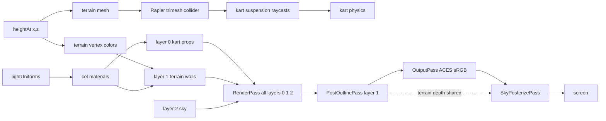

# Rendering Pipeline

The single `RenderPass` renders all scene layers (0, 1, 2) at once into a
HalfFloat LINEAR buffer. Layers are on scene objects via `.layers.set(N)`.
Camera enables layers 1 and 2 explicitly: `camera.layers.enable(1)`;
`camera.layers.enable(2)`. PostOutlinePass re-renders only layer 1 into a
separate normal+depth RT for edge detection.

`SkyPosterizePass` runs after OutputPass (post-tonemap sRGB), applying a
synthetic zenith-to-horizon gradient with cel banding over sky pixels, then
a uniform day-phase color grade + corner vignette over ALL pixels.

Shared mask depth (039): the sky mask needs layers-0+1 depth (sky = the
cleared far plane where no non-sky geometry drew). Rather than re-render
terrain for itself, `SkyPosterizePass`'s own depth pre-pass renders only
layer 0 (solid props/karts/weather) and reads layer-1 (terrain/walls/water)
depth from the sibling `PostOutlinePass` — `Renderer.buildSlot` links
`skyPosterize.terrainDepth = postOutline.normalDepthRT.depthTexture`. The
shader's `sceneDepth(uv)` combines them with `min()`; since a z-buffer keeps
the nearest (smallest) depth per pixel, `min` of the two per-layer buffers
equals the single layers-0+1 buffer the pass used to render, byte for byte —
so the sky mask and god-ray march are bit-identical while terrain renders
once per view instead of twice. Weather (layer 0, `depthWrite:false` in the
main pass) still writes depth in this pre-pass via the opaque override
material, so it stays non-sky and does not receive the gradient (unchanged
from the pre-039 behavior). Both RTs resize together in `ensureSlot` and the
`DepthTexture` object is stable across `setSize`, so the link needs no
re-wiring.
The grade + vignette are resolved once per frame by
`Renderer.applyDayCycle` from `dayCycleState.cycleT` (pure math in
`src/materials/postGrade.ts`) and fanned to each view slot; a
`postGradeStrength` quality knob scales them (full on all tiers).

Both mask passes (`PostOutlinePass` + `SkyPosterizePass`) run in every game
state. `Renderer.renderViews` always enables them, so the menu, select,
countdown, and paused screens share the gameplay backdrop. Without the
posterize pass the raw Preetham `Sky` dome tone-maps (ACES, exposure 1.0) to a
near-white wash; running it everywhere keeps the gradient sky consistent.

`Renderer.applyDayCycle` writes the per-frame linear fog (color/near/far from
`dayCycleState`), then caps near/far to the bounded terrain square via
`scaleFogToWorld(near, far, worldHalfExtent, FOG_EDGE_MARGIN)`. Game sets
`renderer.worldHalfExtent = circuit.worldSize / 2` on field build. The cap only
shrinks the range when the world is smaller than the day-cycle fog far, so
distant terrain hazes out at its boundary instead of ending in a hard edge
against the sky; larger worlds keep their fog unchanged. `near` scales by the
same factor to preserve the gradient shape.

Both `CelMaterial` (terrain/props/clouds) and `celWater` apply this scene fog
(`USE_FOG` block, default on for cel), so distant world geometry mixes toward
the fog colour — the horizon sky band — as it recedes. For fog to hide the
terrain edge, terrain must actually be present out to where fog saturates. So
`Game.buildWorld` scales the terrain stream/cull radii to the world:
`streamRadius = clamp(worldSize/2, 140, 360)`, `cullRadius =
clamp(worldSize/2 + 30, 170, 390)` (day fog-far peaks at 360). Terrain then
streams into the haze and the cull boundary is invisible, rather than culling at
a fixed 170 m — well inside the fog range — which left a visible ground cutoff
(most obvious under the orbiting menu camera). The cap bounds the per-chunk
trimesh-collider ring the largest worlds seed at load; small worlds keep the
compact default. Clouds get the same treatment via `Environment.worldHalfExtent`
(see [Clouds](/environment/clouds.md)). `terrain.streamRadius`/`cullRadius`
overrides still win.

Layers are defined in the [render-layers convention](/conventions/render-layers.md).
Shared lighting originates from [lightUniforms](/materials/cel-material.md).
The pipeline is owned by [Renderer](/core/renderer.md).

## Tests

Tests assert shader source, uniform defaults, and render-target structure.
Tests run under jsdom, no WebGL. Export WebGL-free pure helpers for unit
tests.
