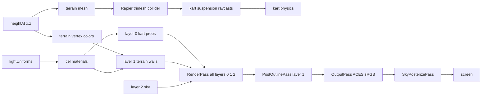

# Rendering Pipeline

The single `RenderPass` renders all scene layers (0, 1, 2) at once into a
HalfFloat LINEAR buffer. Layers are on scene objects via `.layers.set(N)`.
Camera enables layers 1 and 2 explicitly: `camera.layers.enable(1)`;
`camera.layers.enable(2)`. PostOutlinePass re-renders only layer 1 into a
separate normal+depth RT for edge detection.

`SkyPosterizePass` runs after OutputPass (post-tonemap sRGB), applying a
synthetic zenith-to-horizon gradient with cel banding over sky pixels, then
a uniform day-phase color grade + corner vignette over ALL pixels (064).
The grade + vignette are resolved once per frame by
`Renderer.applyDayCycle` from `dayCycleState.cycleT` (pure math in
`src/materials/postGrade.ts`) and fanned to each view slot; a
`postGradeStrength` quality knob scales them (full on all tiers).

Both mask passes (`PostOutlinePass` + `SkyPosterizePass`) run in every game
state. `Renderer.renderViews` always enables them, so the menu, select,
countdown, and paused screens share the gameplay backdrop. Without the
posterize pass the raw Preetham `Sky` dome tone-maps (ACES, exposure 1.0) to a
near-white wash; running it everywhere keeps the gradient sky consistent.

`Renderer.applyDayCycle` writes the per-frame linear fog (color/near/far from
`dayCycleState`), then caps near/far to the bounded terrain square via
`scaleFogToWorld(near, far, worldHalfExtent, FOG_EDGE_MARGIN)`. Game sets
`renderer.worldHalfExtent = circuit.worldSize / 2` on field build. The cap only
shrinks the range when the world is smaller than the day-cycle fog far, so
distant terrain hazes out at its boundary instead of ending in a hard edge
against the sky; larger worlds keep their fog unchanged. `near` scales by the
same factor to preserve the gradient shape.

Layers are defined in the [render-layers convention](/conventions/render-layers.md).
Shared lighting originates from [lightUniforms](/materials/cel-material.md).
The pipeline is owned by [Renderer](/core/renderer.md).

## Tests

Tests assert shader source, uniform defaults, and render-target structure.
Tests run under jsdom, no WebGL. Export WebGL-free pure helpers for unit
tests.
