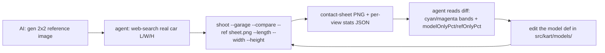

# Garage Compare Loop

Compare mode turns the hidden garage viewer into a contour-matching workbench: a
vision-capable agent supplies one reference car image, the tool renders the
in-game kart from the same four angles, overlays the two silhouettes, highlights
where they diverge, and reports a per-view mismatch number. The agent reads the
resulting contact sheet, edits the kart model def, and re-runs — driving the
model toward the reference. It builds on the [garage viewer](/dev/garage.md) and
the [screenshot harness](/dev/screenshot-harness.md); the pixel/layout math is
the pure `src/dev/garageMask.ts`, `src/dev/garageQuadrant.ts`,
`src/dev/garageRefScale.ts`, and `src/dev/garageContactSheet.ts`, wired to canvas
in `src/dev/garageCompare.ts`.

## The loop



## Reference image (2x2, local only)

The reference is ONE square image laid out as four equal quadrants, each the
same car from a different angle, matching the garage's own views:

```text
+-----------------+-----------------+
| top-left        | top-right       |
|   FRONT         |   SIDE          |
|   (facing you)  |   (nose right)  |
+-----------------+-----------------+
| bottom-left     | bottom-right    |
|   ISO 3/4       |   TOP (plan)    |
|   (hero angle)  |   (nose up)     |
+-----------------+-----------------+
```

It is almost always AI-generated by another model. Keep it LOCAL — put it under
`.agent/` (e.g. `.agent/refs/<car>-2x2.png`), which is git-ignored. Never commit
reference images (the repo forbids committed media). The tool loads it as a
runtime data URL; nothing is written back.

### Generation prompt

Paste this into an image model, replacing the car. The layout labels are
intentionally described but NOT drawn — text in a quadrant would corrupt the
silhouette threshold; the tool infers the mapping from position alone.

```text
A single <car make / model>, drawn four times as a clean flat-color silhouette
illustration, arranged in a 2x2 grid of four equal square quadrants on a pure
white (#ffffff) background. Solid single-color fill (medium gray), no shadows,
no gradients, no reflections, no text, no labels, no badges, no watermark.
Orthographic projection, consistent scale across all four. Top-left: front
elevation, the car facing the viewer. Top-right: left-side elevation, nose
pointing right. Bottom-left: 3/4 front isometric hero view. Bottom-right:
top-down plan view, nose pointing up. Each drawing centered in its quadrant
filling ~80% of it. Square 1:1 output, e.g. 2048x2048 PNG.
```

The background may be off-white and edges anti-aliased — the tool keys the
background by sampling the image corners, so a clean flat backdrop is what
matters, not exact #ffffff.

## Real-world measurements

There is no committed table of car dimensions. Web-search the real car's
length, width, and height in meters and pass them so the reference is placed
true-to-scale:

- `--length` governs the SIDE view (horizontal extent = car length).
- `--width` governs the FRONT and TOP views (horizontal extent = car width).
- `--height` is available for overrides; the vertical axis is left free so a
  too-tall / too-short model shows up as a diff band rather than being scaled
  away.
- `--govern` remaps a view if a generated image is rotated, e.g.
  `--govern top=length` when the top quadrant draws the car nose-sideways.

ISO has no exact meters-to-pixels scale, so it is a proportional bounding-box
fit only (`metric:false` in the JSON) — read it qualitatively (proportions,
stance), not as a measurement.

## Reading the output

`shoot --compare` writes one `<label>.png` and one `<label>.json` under
`.agent/shots/`. The PNG is a grid of the selected `--views` (the full four-view
set mirrors the reference 2x2). Each panel shows the shaded kart with a
silhouette-diff overlay:

- cyan — model extends past the reference (model too big / wrong shape here),
- magenta — reference extends past the model (model too small / missing volume),
- gray — the two silhouettes agree.

Asymmetric cyan/magenta bands read directly as "too wide", "too tall", "nose too
long", etc. The JSON carries per-view `stats`: `modelOnlyPct` and `refOnlyPct`
(each as a percent of the combined silhouette) and `iou` (0..1, higher = closer
match). Minimize `modelOnlyPct`/`refOnlyPct` and push `iou` toward 1 across
edits to the variant's model def under `src/kart/models/`.

## Example

```sh
npm run build   # compare serves dist/ via the preview server
npm run shoot -- --garage --compare --variant speed \
  --views front,side,top,iso --ref .agent/refs/lancia-2x2.png \
  --length 3.90 --width 1.78 --height 1.38 --label lancia-cmp
```

Single angle or a subset works too (`--views side`, `--views front,side`).
Humans can also open `?garage&compare&debug=1&variant=speed` and drop a 2x2
image onto the viewport to render the same sheet interactively.
