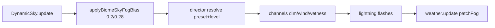

# Schema

# Description

DynamicSky.update writes dayCycleState first. applyBiomeSkyFogBias lerps
fog/sky/sun/ambient toward biome.skyFogBias by biomeTintFactor (default
BIOME_TINT_FACTOR=0.2; tropical 0.28); separate skyZenithTint/
skyHorizonTint win over shared skyTint when set, sunTint/ambientTint bias
light. No-op for temperate (all tints undefined). Director resolves preset
and level; setLevel(k in [0,1]) scales field opacity. Channels compute
dimFactor, windFactor, wetness lerps. Lightning drives additive sun/ambient
boosts (storm only). weather.update patches fog LAST. waterColor ->
CelWater uTint (white = identity). Temperate = undefined = parity;
wildlife [] opts out.

# Construction

Environment constructs each visual subsystem (clouds, water, dynamicSky,
sunDisc, weather, wildlife) exactly once, then adds all six plus dressing
(7 children) to `this.group`. No duplicate construction; first-pass objects
are the live ones so disposal stays single-owner.

# Module layout

Construction helpers live in sibling modules: `dressingConfig.ts` owns
`DressingOptions` + `buildDressingConfig` + `CLOUD_HORIZON_HALF`;
`biomeFanout.ts` owns the pure `biomeEnvironmentOptions` + `worldSubSeeds`
fns (re-exported from `Environment.ts` for import-path stability).

# Cross-References

- [DynamicSky](/environment/dynamic-sky.md)
- [Weather](/environment/weather.md)
- [Water](/environment/water.md)
- [Biomes](/biomes/framework.md)
- [CelMaterial](/materials/cel-material.md)
