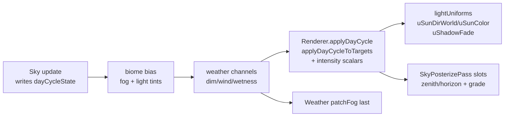

# Schema

Pure time-of-day driver. Given an elapsed time, `computeDayCycle` produces a
full `DayCycleState` (sun arc, phase, color + intensity + fog curves). No
WebGL — only `THREE.Vector3` / `THREE.Color`, which run under jsdom. The
shared `dayCycleState` mutable singleton is the live state DynamicSky writes
each frame; the Renderer, lightUniforms, weather, and post-grade all read it.

Source: `src/environment/dayCycle.ts`.

## cycleT convention

Normalized cycle time `cycleT` (0..1) is the spine of the model:

| cycleT | Phase | Sun position                        |
| ------ | ----- | ----------------------------------- |
| 0      | dawn  | Elevation 0, azimuth 90 (east)      |
| 0.25   | day   | Peak elevation, azimuth 180 (south) |
| 0.5    | dusk  | Elevation 0, azimuth 270 (west)     |
| 0.75   | night | Peak negative elevation             |

Sun elevation is `sin(cycleT * 2pi) * maxElev` (default 62 deg). Azimuth is
`mod(90 + cycleT * 360, 360)`. Sun direction mirrors `lightUniforms.ts`
spherical convention: phi from elevation off +Y, theta from azimuth.

## Pure model functions

- `computeDayCycle(elapsed, opts?): DayCycleState` — full state from an
  elapsed time. Returns a fresh shell whose Color/Vector3 fields alias
  module-level scratch (overwritten on the next call); the singleton shares
  those refs. Never mutates the keyframe tables.
- `phaseFor(sunElevationDeg, isRising): SkyPhase` — elevation + rise/set to
  a single phase bucket. Night when elev < 0, twilight (dawn/dusk) when
  elev < 8 deg, day when elev >= 8. Rising = dawn, setting = dusk.
- `shadowFadeFor(elevDeg): number` — cast-shadow ramp via `smoothstep`.
  Returns 0 below 3 deg, 1 above 18 deg. Drives `uShadowFade` + the
  Renderer `castShadow` gate. Symmetric dawn/dusk: elevation-only.
- `applyDayCycleToTargets(state, dest): void` — copy a state into the
  renderer's persistent Three.js targets (in-place; preserves object
  identities). Intensity scalars and per-slot fan-out are NOT here — the
  Renderer applies those directly.
- `daytimeStartSeconds(dayLengthSeconds?): number` —
  `DAYTIME_START_FRACTION * dayLengthSeconds`. cycleT ~= 0.12 lands on a lit
  mid-morning sun so a race starts lit, not at dawn. Only DynamicSky reads
  this (passed as `dayStartSeconds`); the pure compute fn does not.

## DAYTIME_START_FRACTION

`export const DAYTIME_START_FRACTION = 0.12`. Recommended session start as a
cycle fraction. At maxElev 62 deg this is ~42 deg elevation: short,
well-defined shadows and no grazing-light terminator banding.

## dayCycleState singleton

`export const dayCycleState: DayCycleState = computeDayCycle(0)` —
initialized to dawn at module load. DynamicSky advances the clock each frame
and writes the singleton fields. It is the shared mutable scratch read by
DynamicSky, lightUniforms, weather, and post-grade. Color/Vector3 fields
alias the same pooled scratch `computeDayCycle` writes into, so they are
overwritten in place each frame — consumers that retain a value past the
next write must copy it.

## Types

```ts
type SkyPhase = "dawn" | "day" | "dusk" | "night";

interface DayCycleOptions {
  dayLengthSeconds?: number; // default 120
  maxElevationDeg?: number; // default 62
  dawnDeg?: number; // default 8
  dayStartSeconds?: number; // default 0 (only DynamicSky reads)
}

interface DayCycleState {
  elapsed: number;
  cycleT: number;
  sunElevationDeg: number;
  sunAzimuthDeg: number;
  sunDirWorld: THREE.Vector3;
  phase: SkyPhase;
  nightFactor: number;
  sunColor: THREE.Color;
  sunIntensity: number;
  ambientColor: THREE.Color;
  ambientIntensity: number;
  skyZenith: THREE.Color;
  skyHorizon: THREE.Color;
  fogColor: THREE.Color;
  fogNear: number;
  fogFar: number;
  shadowFade: number;
}

interface DayCycleLightTargets {
  sunColor: THREE.Color;
  ambientColor: THREE.Color;
  fogColor: THREE.Color;
  fog: { near: number; far: number };
  sunDirWorld: THREE.Vector3;
  skyZenith: THREE.Color;
  skyHorizon: THREE.Color;
}
```

Color fields store the raw phase tint only. sun/ambient are LINEAR (Renderer
multiplies by the intensity scalar); sky/fog are sRGB-origin THREE.Color
forwarded to the sky-posterize slots + scene fog.

## Per-frame cascade

`cycleT` flows through the system in a load-bearing order. DynamicSky
writes `dayCycleState` FIRST in the [environment cascade](/environment/cascade.md).
Then the Renderer reads it once per frame at the top of `renderViews` via
`Renderer.applyDayCycle`, which fans the state out:



Key downstream reads:

1. `Renderer.applyDayCycle` calls `applyDayCycleToTargets` to copy tints +
   fog + sun dir into the live Three objects, then applies intensity
   scalars, shadow fade (`uShadowFade`), Sky `sunPosition`, and a per-slot
   zenith/horizon fan-out.
2. `computePostGrade(state.cycleT, strength)` resolves the 064 day-phase
   color grade + vignette uniforms and fans them to every
   `SkyPosterizePass` slot — see [Post Grade Math](/materials/post-grade.md).
3. `lightUniforms` (`src/materials/lightUniforms.ts`) shared uniforms
   (`uSunDirWorld`, `uSunColor`, `uAmbient`, `uShadowFade`) are written by
   the Renderer from the singleton each frame; every cel material
   reads them by ref.
4. Weather channels (`dimFactor`) scale `dayCycleState.sunIntensity` +
   `ambientIntensity` after DynamicSky writes; Weather patches fog LAST.

## Keyframe blend

Four phase keyframes `[dawn, day, dusk, night]` at `KEY_TS = [0, 0.25, 0.5,
0.75]`. `segmentBlend(cycleT)` finds the active segment (night->dawn wraps
over the last 0.25) and returns a smoothstep blend factor. `lerpKeyNum` and
`lerpKeyColor` interpolate scalar/color tables across that blend. The exact
same phase blend drives `postGrade.ts` `GRADE_TABLE`.

# Citations

- [Environment Cascade](/environment/cascade.md)
- [DynamicSky](/environment/dynamic-sky.md)
- [Light Uniforms](/materials/light-uniforms.md)
- [Post Grade Math](/materials/post-grade.md)
