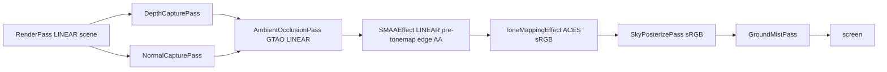

# Anti-aliasing (SMAA)

SMAA post-process edge anti-aliasing (232) for the realism pipeline. The scene
renders to render targets through the pmndrs `EffectComposer`, so the WebGL
context's `antialias:true` MSAA never touches it — before SMAA the pipeline had
NO edge AA on any tier. A pmndrs `SMAAEffect` wrapped in an `EffectPass`
inserted per slot smooths edges on the final pre-tonemap image.

SMAA over TAA: cheap, stateless, no history buffer, no jitter / velocity /
reprojection, no ghosting on fast karts (the TAA failure mode for rapid camera
cuts). TAA deferred.

## Placement

`SMAAEffect` runs in LINEAR sRGB and must be placed BEFORE the tonemap
EffectPass, so it is the LAST linear op: placed right after GTAO
(`AmbientOcclusionPass`), smoothing edges on the final pre-tonemap image just
before ACES + sRGB encode it. Edges are anti-aliased in linear light, not after
tone mapping, avoiding the ringing a post-tonemap AA pass can introduce at
high-contrast silhouettes. The post-tonemap passes (`SkyPosterizePass`,
`GroundMistPass`) run after the tonemap and see an already anti-aliased sRGB
frame.

## Tier gating

The `smaa` knob (`QualityKnobs.smaa`, `src/core/quality.ts`) is `true` on
low/med/high — SMAA ships on EVERY tier. `Renderer.setQuality` forwards it to
each slot's SMAA `EffectPass.enabled`. The EffectComposer skips disabled
passes, so when off SMAA is a byte-identical no-op (no extra fetch). There is no
user-facing Settings toggle: SMAA is foundational quality, not an art-direction
switch (unlike `groundMist` / `ambientOcclusion`, which expose Settings rows).

The WebGL context keeps `antialias:true`, but it is inert through the composer
(the scene renders to render targets, not the default framebuffer), so SMAA is
the pipeline's only edge AA.

## Why SMAA not TAA

TAA needs a history buffer, per-frame jitter, velocity vectors, and
reprojection; it ghosts on fast motion — the exact failure mode for fast karts
with rapid camera cuts. SMAA is single-frame, stateless, and cheap (a few
texture fetches + edge detection), with no temporal artifacts. The tradeoff is
subpixel shimmer (SMAA cannot time-integrate), accepted for the ghost-free
look. TAA stays a future option if a velocity buffer is added.

## Source Links

- `src/core/composerSlot.ts` — `buildComposerSlot` inserts the SMAA `EffectPass`
  (LINEAR, pre-tonemap) into the per-view chain; gated by the passed
  `smaaEnabled`
- `src/core/Renderer.ts` — `setQuality` resolves `smaaEnabled` + fans it to each
  slot's SMAA `EffectPass.enabled`
- `src/core/quality.ts` — `QualityKnobs.smaa` knob, `true` every tier

## Citations

- [Renderer](/core/renderer.md)
- [Render Pipeline](/data-flows/render-pipeline.md)
- [Quality](/core/quality.md)
