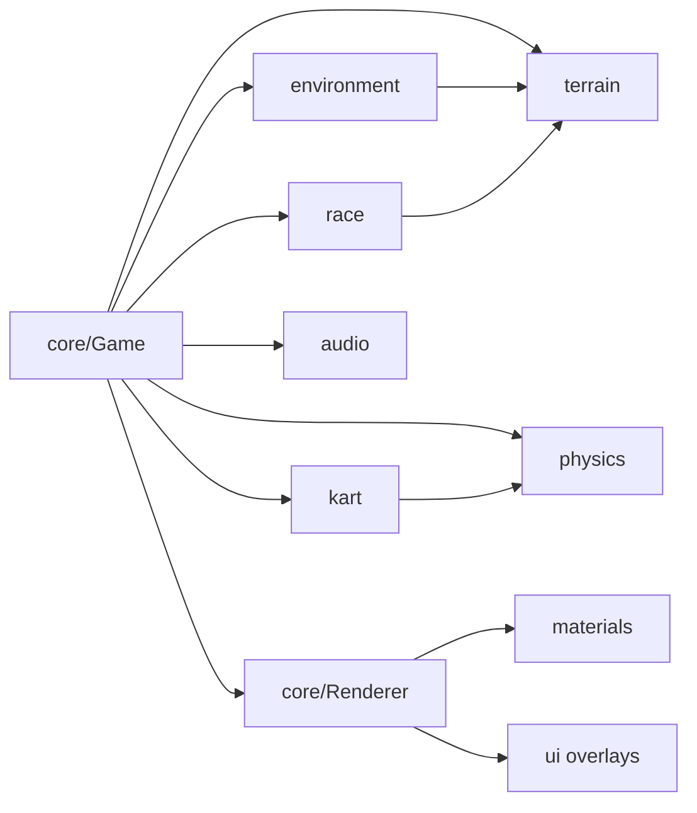

# Source Guidelines

## Directory Map

```text
./src/                 # game source
├── audio/             # Web Audio engine, drift, wind, UI, voice sets
├── core/              # loop, render, input, rng, game state, PlayerView
├── environment/       # props, water, clouds
├── kart/              # kart physics, mesh, chase/menu cam, grid
├── materials/         # cel + outline materials and tests
├── physics/           # Rapier wrapper
├── race/              # checkpoints, ranking, race manager, AI driver
├── terrain/           # heightmap, spline field, terrain mesh
└── ui/                # DOM overlays: start menu, countdown, HUD, minimap
```

## Runtime Flow



## Project Conventions

- Rendering pipeline lives in `core/Renderer.ts` and `materials/`.
- EffectComposer layer numbers:
  - `0`: solid kart + props, inverted-hull outline.
  - `1`: terrain/walls, post Sobel outline.
  - `2`: sky, post posterize.
- Shared sun/ambient uniforms live in `materials/lightUniforms.ts`.
- `Renderer` writes lighting once/frame; all materials read uniforms by ref.
- Custom `ShaderMaterial` output is LINEAR; `OutputPass` applies ACES + sRGB
  once.
- Tests run under jsdom, no WebGL. Export WebGL-free pure helpers for unit
  tests.
- Tests assert shader source, uniform defaults, and render-target structure.
- Terrain subsystem lives in `terrain/`.
- One shared `heightAt(x,z)` fn feeds both visual mesh and Rapier heightfield.
- `heightAt(x,z)` uses SplineFieldCache bilinear lookup plus simplex hills.
- Never sample physics from visual raw arrays, or visuals from collider arrays.
- `CelMaterial` uses `vertexColors:true` for road/grass/rock/sand on layer 1.
- Vertex color attribute values are sRGB->LINEAR to match ColorManagement.
