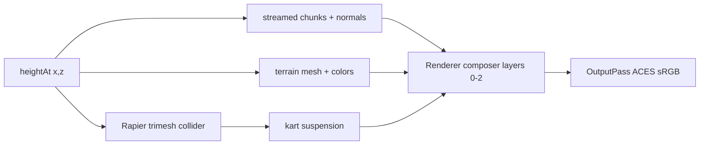
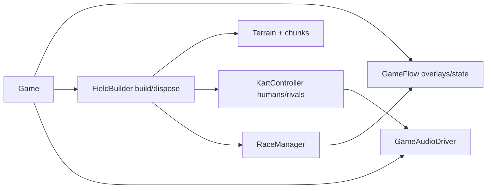

# Source Guidelines

## Directory Map

```text
./src/                 # game source
├── audio/             # Web Audio engine, drift, wind, UI, voices, impacts, respawn, music
├── core/              # loop, render, input, rng, game state, flow, hudSync, stats, quality
├── environment/       # sky/weather/dressing + biomes/; see environment/AGENTS.md
├── kart/              # kart physics, mesh, chase/menu cam, grid, kartLod, action VFX
├── materials/         # cel materials, sky posterize + grade, sun effects and tests
├── physics/           # Rapier wrapper
├── race/              # checkpoints, ranking, race manager, AI driver
├── terrain/           # height surface + mesh/chunks; see terrain/AGENTS.md
└── ui/                # DOM overlays: start menu, countdown, HUD, minimap, StatsHud
```

## Rendering And Terrain Flow



See `docs/knowledge/data-flows/render-pipeline.md` and
`docs/knowledge/terrain/height-pipeline.md` for full architecture.

## Game Ownership Flow



## Source Ownership

- `main.ts` only bootstraps Rapier and creates `Game`.
  See `docs/knowledge/core/game.md`.
- `core/Game.ts` owns composition, lifecycle, field rebuilds, fixed-step
  simulation, render dispatch, and resize. It delegates screen flow to
  `core/GameFlow.ts`.
- Screen flow (GameState, all overlays, Escape routing, persistence) lives in
  `core/GameFlow.ts`; `Game` never constructs an overlay. New overlays land
  in GameFlow. See `docs/knowledge/core/game-flow.md`.
- Per-frame HUD sync lives in `core/hudSync.ts` as pure functions; `Game.frame`
  calls them.
- Keep cross-subsystem orchestration in `Game`; keep reusable rules in pure
  modules near their domain.
- Fixed sim step is `1 / 60`; avoid variable-dt physics changes.
- Human karts occupy indices `0..humanCount-1`; rivals follow those indices.
- 1P race finish mode is `leader`; 2P finish mode is `allHumans`.
- `Input` owns keyboard/gamepad mapping. P1 uses WASD, P2 uses arrows.
  Sign convention: positive steer = turn left; left key -> +steer, right key
  -> -steer, gamepad axis 0 negated (stick right -> -steer).
- On touch devices a third source drives P1 only: `ui/TouchControls` (on-screen
  pedals + `deviceorientation` tilt steer) produces a `KartInput` that
  `Game.frame` merges over the P1 sample via `mergeKartInput`. Tilt is armed by
  an explicit user-gesture "enable" tap (iOS sensor-permission gate); pure math
  in `core/deviceInput.ts`. Not constructed on non-touch (`isTouchDevice`).
- `PlayerView` owns per-human kart/camera/viewport/speed-HUD binding.
- UI classes own their DOM nodes and expose `remove()` for teardown.
- Audio: see `docs/knowledge/data-flows/audio-lifecycle.md`.
  `AudioManager` creates Web Audio only from `resume()` after user gesture;
  all methods stay no-op safe before `resume()` and without AudioContext.
  Node-creation ORDER is load-bearing: buildGraph then startPersistentVoices
  (voices -> wind -> rain -> music -> collision -> rivals).

## Project Conventions

- Rendering pipeline: `core/Renderer.ts` + `materials/`. See
  `docs/knowledge/data-flows/render-pipeline.md` and `docs/knowledge/materials/`.
- EffectComposer layers: 0 (kart/props), 1 (terrain/walls),
  2 (sky/posterize).
- Final composer pass (`SkyPosterizePass`): sky posterize, then a uniform
  day-phase color grade + corner vignette over all pixels (064), resolved
  once/frame by `Renderer.applyDayCycle` from `dayCycleState.cycleT` and
  fanned per slot; tier-gated by `postGradeStrength` (full on all tiers).
  Neutral uniforms reproduce pre-064 output. 074 will add a sun halo to the
  same pass (disjoint hunks).
- `lightUniforms.ts` shared sun/ambient; Renderer writes once/frame; all
  materials read by ref.
- `ShaderMaterial` output is LINEAR; `OutputPass` applies ACES + sRGB.
- Near-terrain surface detail (069): fbm albedo mottle + micro-normal bump
  on the near CelMaterial behind a `SURFACE_DETAIL` define, tier-gated
  (low off). Shading-only — `heightAt` + collider untouched; off-path
  fragment is byte-identical to pre-069.
- Tests run under jsdom, no WebGL. Export WebGL-free pure helpers for unit
  tests. Tests assert shader source, uniform defaults, render-target structure.
- Terrain: `terrain/`. One shared `heightAt(x,z)` feeds visual mesh + colors
  - collider. See `docs/knowledge/terrain/height-pipeline.md`.

## Knowledge Docs

Architecture lives in `@docs/knowledge/core/index.md` and sibling index
files. Update the matching concept in the same commit when behavior, API,
ownership, lifecycle, or data flow changes. Verify claims against source
code — never trust the wiki without checking. Run `npm run lint:okf` after
edits.

## Subsystem Notes

Per-subsystem architecture is in `docs/knowledge/`: `terrain/`, `environment/`,
`kart/`, `race/`, `audio/`, `materials/`, `ui/`, `data-flows/`.
When source behavior changes, update the nearest matching knowledge doc in the
same commit.
