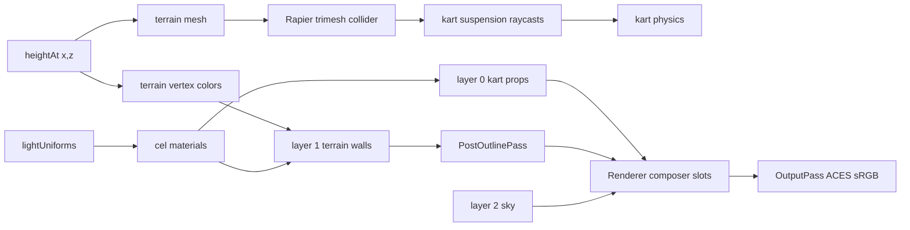

# Source Guidelines

## Directory Map

```text
./src/                 # game source
├── audio/             # Web Audio engine, drift, wind, UI, voices, impacts, respawn, music
├── core/              # loop, render, input, rng, game state, flow, hudSync, stats, quality
├── environment/       # sky/weather/dressing; see environment/AGENTS.md
├── kart/              # kart physics, mesh, chase/menu cam, grid, kartLod, action VFX
├── materials/         # cel + outline materials and tests
├── physics/           # Rapier wrapper
├── race/              # checkpoints, ranking, race manager, AI driver
├── terrain/           # biome data + mesh/chunks; see terrain/AGENTS.md
└── ui/                # DOM overlays: start menu, countdown, HUD, minimap, StatsHud
```

## Rendering And Terrain Flow



## Source Ownership

- `main.ts` only bootstraps Rapier and creates `Game`.
- `core/Game.ts` owns composition, lifecycle, field rebuilds, fixed-step
  simulation, render dispatch, and resize. It delegates screen flow to
  `core/GameFlow.ts` via the `FlowHost` interface and reads `flow.state` in
  `frame()`.
- Screen flow (GameState field, all overlays, every on\* handler, Escape
  routing, persistence) lives in `core/GameFlow.ts`; `Game` never
  constructs an overlay. New overlays land in GameFlow (046 seam).
- Per-frame HUD sync lives in `core/hudSync.ts` as pure functions (no
  `this`, no Game state); `Game.frame` calls them.
- Keep cross-subsystem orchestration in `Game`; keep reusable rules in pure
  modules near their domain.
- Fixed sim step is `1 / 60`; avoid variable-dt physics changes.
- Human karts occupy indices `0..humanCount-1`; rivals follow those indices.
- 1P race finish mode is `leader`; 2P finish mode is `allHumans`.
- `Input` owns keyboard/gamepad mapping. P1 uses WASD, P2 uses arrows.
  Sign convention: positive steer = turn left; left key -> +steer, right key
  -> -steer, gamepad axis 0 negated (stick right -> -steer).
- `PlayerView` owns per-human kart/camera/viewport/speed-HUD binding.
- UI classes own their DOM nodes and expose `remove()` for teardown.
- `AudioManager` keeps the public API, resume/suspend/dispose lifecycle,
  bus-state, per-frame update fan-out, and ALL no-op-before-resume guards
  (046 split).
- Audio graph construction lives in `audio/audioGraph.ts`; the UI beep
  table + player live in `audio/beeps.ts`. Builders take (ctx, buses, opts)
  and return node handles; they hold no AudioManager state.
- Audio node-creation ORDER is load-bearing (mock tests assert indices):
  `resume()` runs buildGraph then startPersistentVoices, whose internal
  order (voices -> wind -> music -> collision -> rivals) must stay stable.
- `AudioManager` creates Web Audio only from `resume()` after user gesture.
- Audio methods must stay no-op safe before `resume()` and without AudioContext.

## Project Conventions

- Rendering pipeline lives in `core/Renderer.ts` and `materials/`.
- EffectComposer layer numbers:
  - `0`: solid kart + props, inverted-hull outline.
  - `1`: terrain/walls, post Sobel outline.
  - `2`: sky, post posterize.
- Shared sun/ambient uniforms live in `materials/lightUniforms.ts`.
- `Renderer` writes lighting once/frame; all materials read uniforms by ref.
- Custom `ShaderMaterial` output is LINEAR; `OutputPass` applies ACES + sRGB
  once.
- Tests run under jsdom, no WebGL. Export WebGL-free pure helpers for unit
  tests.
- Tests assert shader source, uniform defaults, and render-target structure.
- Terrain subsystem lives in `terrain/`.
- One shared `heightAt(x,z)` fn feeds visual mesh and terrain colors.
- `heightAt(x,z)` uses SplineFieldCache bilinear lookup plus simplex hills.
- Terrain collider is Rapier trimesh built from the displaced mesh buffer.
- Keep mesh vertices and collider vertices identical by construction.
- `CelMaterial` uses `vertexColors:true` for road/grass/rock/sand on layer 1.
- Vertex color attribute values are sRGB->LINEAR to match ColorManagement.

## Subsystem Notes

- `terrain/SplineTrack.ts` is the closed loop source for spawn, AI, race, map.
- `race/` is pure-ish. `Game` passes spline `t` poses; race code avoids DOM,
  physics, and Three scene ownership.
- `race/checkpoints.ts` owns cut-proof lap validity. Do not duplicate lap rules.
- `race/AiDriver.ts` returns `KartInput`; `Game` handles respawn side effects.
- `kart/KartController.ts` owns Rapier impulses, suspension, grip, drift, reset.
- `kart/Kart.ts` owns procedural mesh and visual sync from physics bodies.
- `environment/PropField.ts` owns prop Rapier bodies and must remove them on
  `dispose()`. Kind-agnostic: resolves big/collider per kind via
  `floraFor(kind)` from the flora registry (025). Supports a `placements`
  pre-computed option (023) so DressingChunkManager feeds per-chunk samples.
- Flora registry (025): `floraRegistry.ts` is a string-keyed `FloraKind` map;
  each biome module calls `registerFlora(kind, {build, big, collider})` at
  load. `propSampler`/`PropField` carry only the kind label; builders live in
  `flora/temperate.ts` (moved from `propFactory.ts`, byte-identical). Adds
  `floraFor`/`isRegisteredFlora`/`registeredFloraKinds`.
- `environment/DressingChunkManager.ts` (023) streams per-chunk PropField
  bundles driven by camera focus; activate/deactivate + dispose cascade.
- Prop placement and prop geometry are deterministic from seeded RNG helpers.
  Geometry is authored base-at-y=0; `PropField` places the origin at raw
  terrain height. Rock visual radius + collider both derive from the shared
  `rockRadius(seed)` so the collision ball tracks the visible rock and rests
  on the ground.
- `materials/` owns custom shaders and WebGL passes; export pure helpers for
  tests when adding shader math. `waterShading.ts` is the pure mirror (foam
  bands, depth-tint mix, ripple normal, glint band) of the depth-aware
  cel-water GLSL (`celWater.ts`); the shared `WAVE` table is the single
  source of truth both read. Shore foam + depth tint sample the baked
  bed-height field (the same `HeightMapField` cel terrain uses); sun glint
  tracks the world-space sun and is zeroed on low tier via `waterGlintIntensity`.
- `ui/` overlays use plain DOM/canvas with minimal typed inputs from `Game`.
- `ui/menuStyles.ts` (070) is the single source for overlay button visuals
  (primary/secondary/ghost), panel/selector-row styles, and the shared
  MENU_CSS hover/focus block. New overlay buttons use `styleMenuButton`;
  Enter/Space in StartMenu activates the FOCUSED control (SETTINGS opens
  settings), everything else confirms START.
- `core/stats.ts` pure perf budget (PerfSample, classify, FrameMsEwma);
  `ui/StatsHud.ts` self-driving F3 overlay reads renderer.info via it.
- `core/quality.ts` tier -> knobs (pixelRatio + shadow extents);
  `Renderer.setQuality` applies + rebuilds shadow map on change. Default high.
- `kart/kartLod.ts` distance LOD (full/reduced/minimal, hysteresis);
  `Renderer` applies per renderViews from nearest active camera.
- Big props (tree/rock) merge into spatial buckets (one mesh per bucket);
  Rapier colliders stay per-prop, unchanged by merging.
- `environment/critters.ts` holds pure ambient-wildlife placement + orbit
  pose (017). WebGL-free, jsdom-testable like `propSampler`; the `Wildlife`
  InstancedMesh child owns the GL resources.
- `terrain/heightSource.ts` is the height-truth abstraction chunks consume
  (019): `HeightSource` interface (heightAt + colorAt + normalAt) +
  `WorldHeightSource` adapter binding the global heightmap fns + the pure
  `normalFromHeight` central-difference helper. Chunk layer never imports
  `SplineFieldCache` directly so a future streaming track supplies its own
  source.
- `terrain/streamGrid.ts` (023) pure signed-grid helpers (chunkKey,
  chunkBounds, chunkCenter, desiredChunks) shared by terrain + dressing
  streaming drivers.
- `terrain/trackGraph.ts` (057) `SampleIndex`: uniform XZ bucket grid over a
  point set; `nearestSample(x,z)` expanding-ring search returns the true
  global nearest (ties -> lowest index) + `forEachWithin` radius query.
  Accelerates the `SplineFieldCache` bake to sublinear; reused by 059/060.
- `terrain/circuit.ts` (057) `generateCircuit(seed)`: attempt loop + taming
  - anti-oval accept gate (valid AND interesting) + test-asserted fallback;
    `validateCircuit` -> radius/tiered-separation/self-intersection + corner
    metrics. `circuitGen.ts` `buildMainline` pipeline (scatter -> hull ->
    fillet arcs -> keyhole hairpins/chicanes -> displace -> relax) over
    `circuitShape.ts` 2D loop primitives. All pure, jsdom.
- `terrain/chunkBuilder.ts` is a pure per-chunk geometry builder (019):
  `buildChunk` + `buildSkirt` emit typed-array positions/colors/normals/indices
  from a HeightSource. Normals come straight from `src.normalAt` (world
  consistent) so neighbour chunk borders shade identically; jsdom-testable +
  worker-able; winding mirrors the Terrain trimesh so a chunk's mesh + collider
  share verts by construction.
- `kart/kartVfx.ts` is the pure emitter + ring-buffer core (053 c1); no THREE
  imports, jsdom-tested. `kart/KartVfxLayer.ts` is the GL owner: ONE
  `THREE.Points` on layer 0 for all karts, GPU-advanced by `uTime` like Weather
  (vertex shader ages/moves/fades; partial buffer updates via `addUpdateRange`).
  Filename split (file `KartVfxLayer`, class `KartVfx`) is the macOS
  case-insensitive FS workaround (`KartVfx.ts` collides with `kartVfx.ts`); CI
  on case-sensitive Linux treats both as independent files.
- `kart/skidMarks.ts` is the pure segment + age-fade math (053 c3);
  `kart/SkidMarksLayer.ts` is the GL owner: one quad-strip Mesh on layer 1,
  terrain-conformed (heightAt + normalAt offset) at append time, with
  `polygonOffset` vs z-fighting and an age-fade shader keyed on `uTime`. Same
  filename-split rationale (file `SkidMarksLayer`, class `SkidMarks`).
- Emission rules (`emissionRate`): dust above 8 m/s on grounded rear wheels
  (tint via terrain `colorAt` lerped toward white), drift smoke while
  `isDrifting` + grounded, splash while `inWater`, `poof` burst via `burst()`
  at respawn (queued next to `gameAudio.onRespawn()`). Skid marks append while
  drifting + rear-grounded + moved > `minStep`; ~6 s linear fade
  (`SKID_FADE_TIME`). Both GL layers read `uAmbient` from `lightUniforms` so
  particles/marks darken at night.
- Quality tiers (`core/quality.ts`): `vfxParticleBudget` (512/1536/3072) +
  `skidSegments` (256/512/1024) scale the ring buffers;
  `FieldBuilder.setQuality` + `Game.setQuality` forward tier changes. Domain
  modules export matching copies (`VFX_BUDGET` in kartVfx.ts, `SKID_SEGMENTS`
  in skidMarks.ts) kept in sync by comment so the GL owners stay decoupled
  from `core/`.
