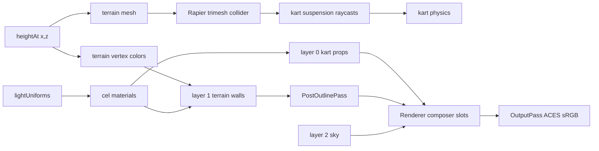

# Source Guidelines

## Directory Map

```text
./src/                 # game source
├── audio/             # Web Audio engine, drift, wind, UI, voices, impacts, respawn, music
├── core/              # loop, render, input, rng, game state, PlayerView, stats, quality
├── environment/       # props, water, clouds, sky, sun disc, weather, critters
├── kart/              # kart physics, mesh, chase/menu cam, grid, kartLod
├── materials/         # cel + outline materials and tests
├── physics/           # Rapier wrapper
├── race/              # checkpoints, ranking, race manager, AI driver
├── terrain/           # heightmap, spline field, terrain mesh, height source, chunk builder
└── ui/                # DOM overlays: start menu, countdown, HUD, minimap, StatsHud
```

## Rendering And Terrain Flow



## Source Ownership

- `main.ts` only bootstraps Rapier and creates `Game`.
- `core/Game.ts` owns composition, lifecycle, field rebuilds, and fixed-step
  simulation.
- Keep cross-subsystem orchestration in `Game`; keep reusable rules in pure
  modules near their domain.
- Fixed sim step is `1 / 60`; avoid variable-dt physics changes.
- Human karts occupy indices `0..humanCount-1`; rivals follow those indices.
- 1P race finish mode is `leader`; 2P finish mode is `allHumans`.
- `Input` owns keyboard/gamepad mapping. P1 uses WASD, P2 uses arrows.
  Sign convention: positive steer = turn left; left key -> +steer, right key
  -> -steer, gamepad axis 0 negated (stick right -> -steer).
- `PlayerView` owns per-human kart/camera/viewport/speed-HUD binding.
- UI classes own their DOM nodes and expose `remove()` for teardown.
- `AudioManager` creates Web Audio only from `resume()` after user gesture.
- Audio methods must stay no-op safe before `resume()` and without AudioContext.

## Project Conventions

- Rendering pipeline lives in `core/Renderer.ts` and `materials/`.
- EffectComposer layer numbers:
  - `0`: solid kart + props, inverted-hull outline.
  - `1`: terrain/walls, post Sobel outline.
  - `2`: sky, post posterize.
- Shared sun/ambient uniforms live in `materials/lightUniforms.ts`.
- `Renderer` writes lighting once/frame; all materials read uniforms by ref.
- Custom `ShaderMaterial` output is LINEAR; `OutputPass` applies ACES + sRGB
  once.
- Tests run under jsdom, no WebGL. Export WebGL-free pure helpers for unit
  tests.
- Tests assert shader source, uniform defaults, and render-target structure.
- Terrain subsystem lives in `terrain/`.
- One shared `heightAt(x,z)` fn feeds visual mesh and terrain colors.
- `heightAt(x,z)` uses SplineFieldCache bilinear lookup plus simplex hills.
- Terrain collider is Rapier trimesh built from the displaced mesh buffer.
- Keep mesh vertices and collider vertices identical by construction.
- `CelMaterial` uses `vertexColors:true` for road/grass/rock/sand on layer 1.
- Vertex color attribute values are sRGB->LINEAR to match ColorManagement.

## Subsystem Notes

- `terrain/SplineTrack.ts` is the closed loop source for spawn, AI, race, map.
- `race/` is pure-ish. `Game` passes spline `t` poses; race code avoids DOM,
  physics, and Three scene ownership.
- `race/checkpoints.ts` owns cut-proof lap validity. Do not duplicate lap rules.
- `race/AiDriver.ts` returns `KartInput`; `Game` handles respawn side effects.
- `kart/KartController.ts` owns Rapier impulses, suspension, grip, drift, reset.
- `kart/Kart.ts` owns procedural mesh and visual sync from physics bodies.
- `environment/PropField.ts` owns prop Rapier bodies and must remove them on
  `dispose()`.
- `environment/DressingChunkManager.ts` (023) streams per-chunk PropField
  bundles driven by camera focus; activate/deactivate + dispose cascade.
- Prop placement and prop geometry are deterministic from seeded RNG helpers.
  Geometry is authored base-at-y=0; `PropField` places the origin at raw
  terrain height. Rock visual radius + collider both derive from the shared
  `rockRadius(seed)` so the collision ball tracks the visible rock and rests
  on the ground.
- `materials/` owns custom shaders and WebGL passes; export pure helpers for
  tests when adding shader math.
- `ui/` overlays use plain DOM/canvas with minimal typed inputs from `Game`.
- `core/stats.ts` pure perf budget (PerfSample, classify, FrameMsEwma);
  `ui/StatsHud.ts` self-driving F3 overlay reads renderer.info via it.
- `core/quality.ts` tier -> knobs (pixelRatio + shadow extents);
  `Renderer.setQuality` applies + rebuilds shadow map on change. Default high.
- `kart/kartLod.ts` distance LOD (full/reduced/minimal, hysteresis);
  `Renderer` applies per renderViews from nearest active camera.
- Big props (tree/rock) merge into spatial buckets (one mesh per bucket);
  Rapier colliders stay per-prop, unchanged by merging.
- `environment/critters.ts` holds pure ambient-wildlife placement + orbit
  pose (017). WebGL-free, jsdom-testable like `propSampler`; the `Wildlife`
  InstancedMesh child owns the GL resources.
- `terrain/heightSource.ts` is the height-truth abstraction chunks consume
  (019): `HeightSource` interface (heightAt + colorAt + normalAt) +
  `WorldHeightSource` adapter binding the global heightmap fns + the pure
  `normalFromHeight` central-difference helper. Chunk layer never imports
  `SplineFieldCache` directly so a future streaming track supplies its own
  source.
- `terrain/streamGrid.ts` (023) pure signed-grid helpers (chunkKey,
  chunkBounds, chunkCenter, desiredChunks) shared by terrain + dressing
  streaming drivers.
- `terrain/chunkBuilder.ts` is a pure per-chunk geometry builder (019):
  `buildChunk` + `buildSkirt` emit typed-array positions/colors/normals/indices
  from a HeightSource. Normals come straight from `src.normalAt` (world
  consistent) so neighbour chunk borders shade identically; jsdom-testable +
  worker-able; winding mirrors the Terrain trimesh so a chunk's mesh + collider
  share verts by construction.
