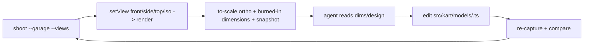

# Dev Tooling Guidelines

Dev-only inspection surfaces, reached via URL flags (e.g. `?garage`). Not part
of the race runtime; main.ts mounts them and owns teardown. Reuse game systems
(kart visual, measurement, cel materials) rather than reinventing render setup.

## Directory Map

```text
./src/dev/            # dev-only viewers + tooling
├── Garage.ts            # createGarage: kart viewer (views, dimension overlay, agent API)
├── garagePanel.ts       # DOM control panel builder (selects/toggles/readout), jsdom-safe
├── garageSvg.ts         # SVG overlay renderer (grid/scale/dimension lines into an <svg>)
├── garageViews.ts       # pure camera-framing math: ortho frustum + exact px/m, iso params
├── garageOverlay.ts     # pure overlay builder: grid, scale bar, labeled dimension lines
├── garageMeasure.ts     # pure readout formatting + reference scale-calibration math
├── garageMask.ts        # pure silhouette masks + model-vs-ref diff classify/paint
├── garageQuadrant.ts    # pure 2x2 reference-image slice rects per view
├── garageContactSheet.ts# pure contact-sheet grid layout + views CSV parse
├── garageRefScale.ts    # pure ref->model alignment/scale contract + mask resample
├── garageCompare.ts     # canvas/WebGL glue: silhouette+ref masks -> diff contact sheet
├── garageViews.test.ts  # jsdom: framing px/m + fit per view
├── garageOverlay.test.ts# jsdom: dimension-line endpoints/labels; iso empty
├── garageMask.test.ts   # jsdom: mask threshold/keying, diff counts + stats + paint
├── garageQuadrant.test.ts   # jsdom: quadrant rects (even/odd sizes) + layout
├── garageContactSheet.test.ts # jsdom: sheet layout 1/2/4 views + parseViews
├── garageRefScale.test.ts   # jsdom: governing dim, placement scale, resample
└── Garage.test.ts       # jsdom: measure helpers + null-under-no-WebGL guard
```

## Vision-agent loop



A vision-capable agent drives the garage headlessly to match a kart to a design:

- Capture to-scale views + measurements via the shoot harness, e.g.
  `npm run shoot --garage --variant <id> --views front,side,top,iso`.
- front/side/top render through an OrthographicCamera framed to the measured
  bounds; the SVG overlay burns in a 0.5 m grid, a 1 m scale bar, and labeled
  dimension lines, so `pixelsPerMeter = canvasHeightPx / frustumHeightMeters` is
  exact and every metric maps to `center +/- value/2 * pixelsPerMeter`.
- Read the dimensions/design, edit the kart model def at
  `src/kart/models/<variant>.ts`, then re-capture and compare.

## Agent API + invariants

- `createGarage` returns a `GarageHandle`: `el` (root, class `gc-garage`, the
  screenshot target), `setStyle`, `setView`, `setGrid`, `setReference`,
  `setReferenceSheet`, `setRealDims`, `compareSheet`, `snapshot`, `dispose`.
  `setStyle`/`setView`/`setReference` render one frame synchronously so an
  immediate screenshot is correct while RAF is idle.
- Compare mode (`?compare`): `setReferenceSheet(dataUrl)` decodes a 2x2
  reference sheet, `setRealDims({length,width,height}, govern?)` sets the
  agent-searched real dims, and `compareSheet(views?)` returns
  `{ dataUrl, views }` — one contact-sheet PNG (shaded model + cyan/magenta/gray
  silhouette diff per view) plus per-view `pixelsPerMeter`/`metric`/`stats`
  (`modelOnlyPct`/`refOnlyPct`/`iou`). iso is proportional (`metric:false`).
- `snapshot()` -> `{ variant, colorway, view, dimensions, pixelsPerMeter,
viewport }`; `pixelsPerMeter` is null on the iso (perspective) view.
- URL params `variant`, `colorway`, `view`, `grid` seed initial state; unknown
  values are ignored (validated vs the registries / GarageView set).
- Pure framing/overlay math lives in `garageViews.ts` + `garageOverlay.ts`
  (WebGL-free, jsdom-tested); `Garage.ts` owns GL/DOM/RAF wiring and returns
  null without WebGL. Reuses the KartPreview render pattern (private
  WebGLRenderer + EffectComposer, `applyStudioLight` fixed light).
- Measurements come from `../kart/models/measure.ts` (`measureKart`); formatting
  and scale math live in `garageMeasure.ts`.
- Reference images are runtime-only: a File uses `URL.createObjectURL` (revoked
  on replace/dispose); a data URL from `setReference` is caller-owned and never
  revoked. Never write or commit image assets.
- `dispose()` stops RAF, revokes object URLs, frees GL, removes listeners + DOM.

## Knowledge Docs

Architecture details → `@docs/knowledge/dev/index.md`. Update the matching
concept in the same commit when source behavior changes. Verify claims against
source code. Run `npm run lint:okf` after edits.
