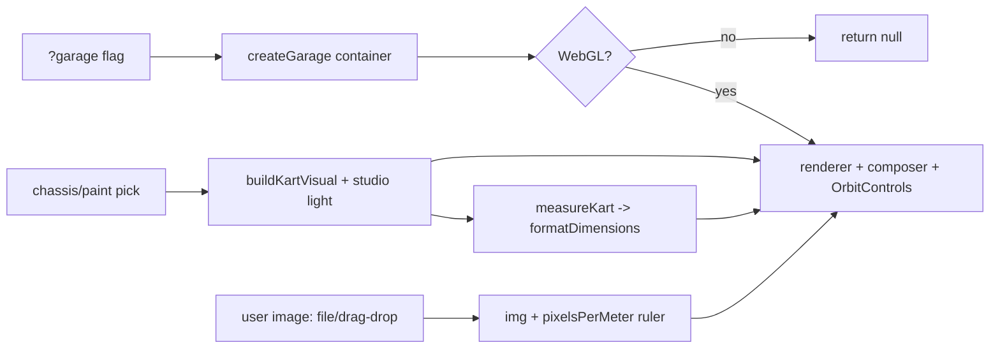

# Dev Tooling Guidelines

Dev-only inspection surfaces, reached via URL flags (e.g. `?garage`). Not part
of the race runtime; main.ts mounts them and owns teardown. Reuse game systems
(kart visual, measurement, cel materials) rather than reinventing render setup.

## Directory Map

```text
./src/dev/            # dev-only viewers + tooling
├── Garage.ts            # createGarage: isolated kart viewer (orbit, measure, ref overlay)
├── garageMeasure.ts     # pure readout formatting + scale-calibration math (jsdom-tested)
└── Garage.test.ts       # jsdom suite: helpers + null-under-no-WebGL guard
```

## Garage Flow



## Reuse + invariants

- Garage copies the KartPreview render pattern: private WebGLRenderer +
  EffectComposer (RenderPass -> OutputPass, ACES/sRGB) and `applyStudioLight`
  fixed-light override on cel materials. `createGarage` returns null when no
  WebGL context exists (jsdom), so tests never touch GL.
- Measurements come from `../kart/models/measure.ts` (`measureKart`); formatting
  and scale math live in the pure `garageMeasure.ts` so they are unit-tested.
- Reference images are runtime-only: `URL.createObjectURL` on load, revoked on
  replace/dispose. Never write or commit image assets.
- `dispose()` stops RAF, revokes object URLs, frees GL (renderer/composer/grid/
  box helper + `disposeKartVisual`), removes listeners and DOM.

## Knowledge Docs

Architecture details → `@docs/knowledge/dev/index.md`. Update the matching
concept in the same commit when source behavior changes. Verify claims against
source code. Run `npm run lint:okf` after edits.
