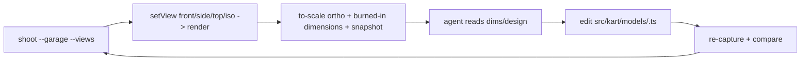

# Dev Tooling Guidelines

Dev-only inspection surfaces, reached via URL flags (e.g. `?garage`). Not part
of the race runtime; main.ts mounts them and owns teardown. Reuse game systems
(kart visual, measurement, cel materials) rather than reinventing render setup.

## Directory Map

```text
./src/dev/            # dev-only viewers + tooling
├── Garage.ts            # createGarage: single-view kart viewer (views, overlay, agent API)
├── GarageGrid.ts        # createGarageGrid: multi-angle grid (contact sheet) viewer
├── garageViews.ts       # pure camera-framing math: ortho frustum + exact px/m, iso params
├── garageOverlay.ts     # pure overlay builder: grid, scale bar, labeled dimension lines
├── garageOverlayDom.ts  # SVG writer for overlay primitives (shared by Garage + grid)
├── gridLayout.ts        # pure grid tiling: gridShape/tileRects/parseViewsParam
├── garageMeasure.ts     # pure readout formatting + reference scale-calibration math
├── garageViews.test.ts  # jsdom: framing px/m + fit per view
├── garageOverlay.test.ts# jsdom: dimension-line endpoints/labels; iso empty
├── gridLayout.test.ts   # jsdom: gridShape/tileRects/parseViewsParam
├── GarageGrid.test.ts   # jsdom: null-under-no-WebGL guard
└── Garage.test.ts       # jsdom: measure helpers + null-under-no-WebGL guard
```

The single-view viewer (`Garage.ts`, `?garage`) shows one angle at a time; the
grid viewer (`GarageGrid.ts`, `?garage&layout=grid|gallery`) renders every
requested angle at once as a contact sheet, each tile with its own to-scale
overlay + optional per-angle reference contour. Both reuse the same framing
(`garageViews.ts`), overlay (`garageOverlay.ts` + `garageOverlayDom.ts`), studio
light (`../kart/studioLight.ts`), and mesh (`../kart/kartVisual.ts`).

## Vision-agent loop



A vision-capable agent drives the garage headlessly to match a kart to a design:

- Capture to-scale views + measurements via the shoot harness, e.g.
  `npm run shoot --garage --variant <id> --views front,side,top,iso`.
- front/side/top render through an OrthographicCamera framed to the measured
  bounds; the SVG overlay burns in a 0.5 m grid, a 1 m scale bar, and labeled
  dimension lines, so `pixelsPerMeter = canvasHeightPx / frustumHeightMeters` is
  exact and every metric maps to `center +/- value/2 * pixelsPerMeter`.
- Read the dimensions/design, edit the kart model def at
  `src/kart/models/<variant>.ts`, then re-capture and compare.

## Agent API + invariants

- `createGarage` returns a `GarageHandle`: `el` (root, class `gc-garage`, the
  screenshot target), `setStyle`, `setView`, `setGrid`, `setReference`,
  `snapshot`, `dispose`. `setStyle`/`setView`/`setReference` render one frame
  synchronously so an immediate screenshot is correct while RAF is idle.
- `snapshot()` -> `{ variant, colorway, view, dimensions, pixelsPerMeter,
viewport }`; `pixelsPerMeter` is null on the iso (perspective) view.
- URL params `variant`, `colorway`, `view`, `grid` seed initial state; unknown
  values are ignored (validated vs the registries / GarageView set).
- `createGarageGrid` returns a `GarageGridHandle`: `el` (root, class
  `gc-garage gc-garage-grid`), `setStyle`, `setReference(view, dataUrl | null,
realMeters?)` (per-angle), `setGrid`, `snapshot`, `dispose`. Its `snapshot()`
  is keyed by view: `{ variant, colorway, views, tiles: Record<view, {
dimensions, pixelsPerMeter, rect }>, viewport }`. URL params add `layout`
  (grid|gallery), `views` (tile subset), and `ref-<view>` (per-angle contour).
- Pure framing/overlay/tiling math lives in `garageViews.ts`,
  `garageOverlay.ts`, and `gridLayout.ts` (WebGL-free, jsdom-tested); the viewers
  own GL/DOM/RAF wiring and return null without WebGL. Fixed studio light is the
  shared `../kart/studioLight.ts` (`applyStudioLight`).
- Measurements come from `../kart/models/measure.ts` (`measureKart`); formatting
  and scale math live in `garageMeasure.ts`.
- Reference images are runtime-only: a File uses `URL.createObjectURL` (revoked
  on replace/dispose); a data URL from `setReference` is caller-owned and never
  revoked. Never write or commit image assets.
- `dispose()` stops RAF, revokes object URLs, frees GL, removes listeners + DOM.

## Knowledge Docs

Architecture details → `@docs/knowledge/dev/index.md`. Update the matching
concept in the same commit when source behavior changes. Verify claims against
source code. Run `npm run lint:okf` after edits.
