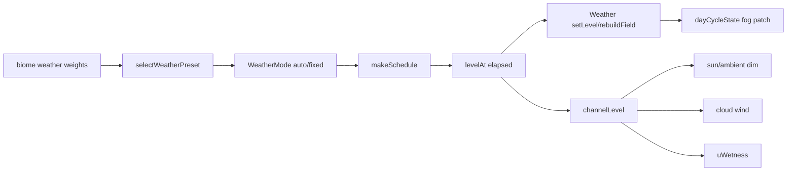

# Environment Guidelines

Owns the sky/weather/water/clouds/dressing mood stack + the biome bias
cascade that ties biome data (`../terrain/biomes.ts`) to the per-frame
scene. Biome framework + authoring runbook: `../terrain/AGENTS.md`.

## Directory Map

```text
./src/environment/    # mood + dressing stack
├── weatherPresets.ts    # WeatherPreset union + WEATHER_PRESET_CONFIG
├── weatherDirector.ts   # makeSchedule/levelAt (auto/fixed fronts)
├── weatherChannels.ts   # dim/wind/wetness targets per preset
├── Weather.ts           # GPU Points field + fog patch + setLevel
├── lightning.ts         # storm flash schedule
├── DynamicSky.ts        # day-cycle clock + stars/moon (layer 2)
├── dayCycle.ts          # dayCycleState singleton (scratch refs)
├── SunDisc.ts           # additive sun-disc overlay
├── Clouds.ts            # drifting layer 0 puffs (+ cloudCluster/tint)
├── Water.ts             # cel valley plane (layer 1)
├── Environment.ts       # composes all; owns the update cascade
├── floraRegistry.ts     # registerFlora/floraFor/registeredFloraKinds
├── flora/               # per-biome modules + archetypes.ts (knobs)
├── PropField.ts         # prop Rapier bodies; dispose() required
├── propFactory.ts       # BuiltProp/mergeOrFirst/prepPart/ROCK_BURY
├── propSampler.ts       # deterministic placement
├── DressingChunkManager.ts # streams per-chunk PropField bundles
├── critters.ts          # pure wildlife placement; Wildlife.ts owns GL
└── *.test.ts            # jsdom suites
```

## Weather Framework

Weather is a seeded, deterministic mood driver. A biome's `weather` weights
pick a preset; the director turns that into a schedule of fading fronts;
channels map the live level to sky/cloud/ground effects; the Weather class
renders a GPU Points field.



### Presets (`weatherPresets.ts`)

`WeatherPreset` union: `clear/rain/snow/fog/sandstorm/blizzard/heatHaze/
aurora/storm/warmRain`. `clear` builds nothing; the rest spawn a Points
field. `WEATHER_PRESET_CONFIG` holds particle + fog params per non-clear
preset (color/size/opacity/fall/windFactor/drift/fogTint/fogNearFactor/
fogFarFactor/ceiling?). rain + snow mirror pre-biome constants exactly
(per-particle RNG draw order included) for bit-identical legacy fields.

`PRESET_ORDER` fixes the cumulative-walk order so
`selectWeatherPreset(weights, seed)` is deterministic regardless of object
key insertion order; `DEFAULT_WEATHER_WEIGHTS` (clear .7 / rain .15 / snow
.15) reproduces the pre-biome partition bit-for-bit. DO NOT reorder
PRESET_ORDER without updating Weather.test.ts parity. storm/warmRain are
appended (no DEFAULT key) so the legacy walk is unchanged.

### Director (`weatherDirector.ts`)

`WeatherMode = "auto" | WeatherPreset`. A concrete preset is FIXED = one
infinite segment at level 1 (clear -> level 0 forever); that is the DEFAULT
(Environment resolves the session pick) so a session opens bit-identical.
`"auto"` builds `AUTO_SEGMENTS` (10) fronts: seg 0 preset ==
`selectWeatherPreset(weights, seed)` (opens at full level 1, fadeIn 0);
each later seg re-rolls `selectWeatherPreset(weights, seed ^
hashSeed("weather-seg"+i))`; the last holds forever.

`makeSchedule` -> `WeatherSchedule` (trapezoid segments + cumulative
starts). `levelAt(schedule, t)` -> `{preset, level}`: smoothstep 0->1
across fadeIn, 1 across hold, 1->0 across fadeOut. Preset transitions
happen ONLY at segment boundaries where level is exactly 0 by construction.
Auto timings: `SEG_HOLD_SEC=70`, `SEG_FADE_SEC=10` (~12 min of weather).

Environment swaps the Weather field (`rebuildField`) ONLY at a zero crossing
(level <= 0) so the default single-segment schedule never swaps. Per frame
it calls `setLevel(level)` (a no-op-parity write when unchanged).

### Channels (`weatherChannels.ts`)

`WEATHER_CHANNELS[preset]` = `{dim, windFactor, wetness}`. Existing presets
keep dim=1 + windFactor=1 so sky + clouds stay byte-identical; only
wetness is non-trivial (rain 1, snow .3). storm dims (0.7) + winds (1.8);
warmRain = bright rain (dim 1, wind 1.1, wetness 1).
`channelLevel(preset, level)` lerps per-frame: level 0 -> identity
(dimFactor 1, windFactor 1, wetness 0) so a fade-out fully reverts.
dimFactor scales `dayCycleState.sunIntensity` + `ambientIntensity`;
windFactor scales cloud drift; wetness writes `wetnessUniform.uWetness`
(fans out by ref to every terrain CelMaterial).

### Weather class (`Weather.ts`)

One `THREE.Points` field on layer 0 (`depthWrite:false`, `fog:true`).
Particle motion runs entirely in the vertex shader: base `position` +
per-particle `velocity` uploaded once, advanced by monotonic `uTime` with
the stateless wrap in `advancePosition` (XZ wrap around a moving focus; Y
resets at ceiling). No per-frame CPU loop or buffer re-upload.

`setLevel(k)` scales `uOpacity` against the field's base opacity (0..1; 1 =
bit-identical pre-envelope). `rebuildField(preset, seed)` swaps the field at
the current level (rain/snow init stays bit-identical) so a director can
rebuild invisible (0) then fade in. `update(dt, focusX, focusZ)` advances
uTime + patches `dayCycleState` fog (near/far pulled by preset factors, fog
color lerped 25% toward the preset tint) AFTER DynamicSky writes it.
`patchFog` reads the live level each update; do not cache fog values across
frames (DynamicSky replaces the `fogColor` ref; near/far are reassigns).

### Lightning (`lightning.ts`)

Storm-only. `makeLightningSchedule(seed)` + `activeFlash` drive additive
sun/ambient boosts for `FLASH_DURATION`. Environment builds the schedule
lazily when the active preset is storm and clears it on any non-storm front
so a handover stops flashing at once.

## Biome bias cascade

`Environment.update` order is load-bearing (biome side:
`../terrain/AGENTS.md`):

DynamicSky.update writes dayCycleState -> `applyBiomeSkyFogBias` lerps
fog/sky toward `biome.skyFogBias` by `BIOME_TINT_FACTOR=0.2` (no-op for
temperate) -> director resolves `{preset,level}` + `setLevel` -> channels
(dim/wind/wetness) -> lightning -> `weather.update` (patchFog stacks on
fog LAST).

waterColor -> CelWater `uTint` (white = identity). Temperate = undefined =
parity; `wildlife []` opts out. So a clear-temperate session stays
bit-identical to pre-biome.

CelWater (062) is depth-aware: it samples the terrain bed-height field
(`Terrain.heightMapField()` -> `HeightMapField`, plumbed via `Water`/
`Environment`) for a banded shore-foam line + shallow->deep tint by true
depth, plus a quantized world-space sun glint. Outside the baked field it
falls back to the legacy facing look (no seam pop). Pure math mirror:
`../materials/waterShading.ts`. Low tier zeroes glints
(`qualityKnobs.waterGlintIntensity` -> `Environment.setQuality`).

## Persistence

`weatherStorage` persists the chosen mode under `gamecart.weather.v1`.
`weatherConfig` maps race-config weather names to `WeatherMode` for preview
(no Environment rebuild).

## See also

- `../terrain/AGENTS.md` -> biome framework + authoring runbook.
- 054 dynamic-weather, 010 dynamic-sky-weather, 041 weather-gpu-particles.
