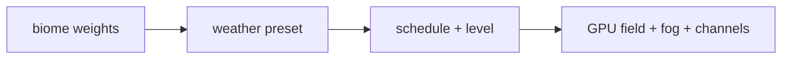
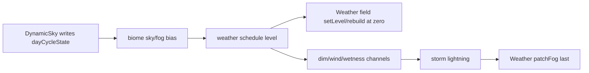

# Environment Guidelines

Owns the sky/weather/water/clouds/dressing mood stack + the biome bias
cascade that ties biome data (`./biomes/registry.ts`) to the per-frame
scene. Biome framework + authoring runbook: `./biomes/AGENTS.md`.

## Directory Map

```text
./src/environment/    # mood + dressing stack + biomes
├── biomes/              # per-biome dirs: data + flora + vibe; see biomes/AGENTS.md
├── weatherPresets.ts    # WeatherPreset union + WEATHER_PRESET_CONFIG
├── weatherDirector.ts   # makeSchedule/levelAt (auto/fixed fronts)
├── weatherChannels.ts   # dim/wind/wetness targets per preset
├── Weather.ts           # GPU Points field + fog patch + setLevel
├── lightning.ts         # storm flash schedule
├── DynamicSky.ts        # day-cycle clock + stars/moon (layer 0)
├── dayCycle.ts          # dayCycleState singleton (scratch refs)
├── SkyCapture.ts        # runtime sky cubemap capture -> lightUniforms.uSkyEnv
├── SunDisc.ts           # additive sun-disc overlay
├── Clouds.ts            # drifting layer 0 puffs (+ cloudCluster/tint)
├── WaterChunkManager.ts # streamed cel water tiles (layer 1)
├── Environment.ts       # composes all; owns the update cascade
├── floraRegistry.ts     # registerFlora/floraFor/registeredFloraKinds
├── flora/               # archetype library: trees/rocks/shrubs/groundcover
├── PropField.ts         # prop Rapier bodies; dispose() required
├── propFactory.ts       # BuiltProp/mergeOrFirst/prepPart/ROCK_BURY
├── propSampler.ts       # deterministic placement
├── DressingChunkManager.ts # streams per-chunk PropField bundles
├── trackDecals.ts       # 063 pure checkered start-line decal builder
├── TrackDressing.ts      # 063 GL owner: start-line decal + gantry + flag
├── critters.ts          # pure wildlife placement; Wildlife.ts owns GL
└── *.test.ts            # jsdom suites
```

## Weather Framework

Weather is a seeded, deterministic mood driver.



See `docs/knowledge/environment/weather.md` for presets, director, channels,
GPU particle field, persistence, and storm lightning.

## Biome bias cascade

`Environment.update` order is load-bearing.



See `docs/knowledge/environment/cascade.md`.

## Persistence

See `docs/knowledge/environment/weather.md`.

## Knowledge Docs

Architecture details → `@docs/knowledge/environment/index.md`. Update the
matching concept in the same commit when source behavior changes. Verify
claims against source code. Run `npm run lint:okf` after edits.

## See also

- `./biomes/AGENTS.md` -> biome framework + authoring runbook.
- `docs/knowledge/environment/` -> sky, weather, water, dressing details.
