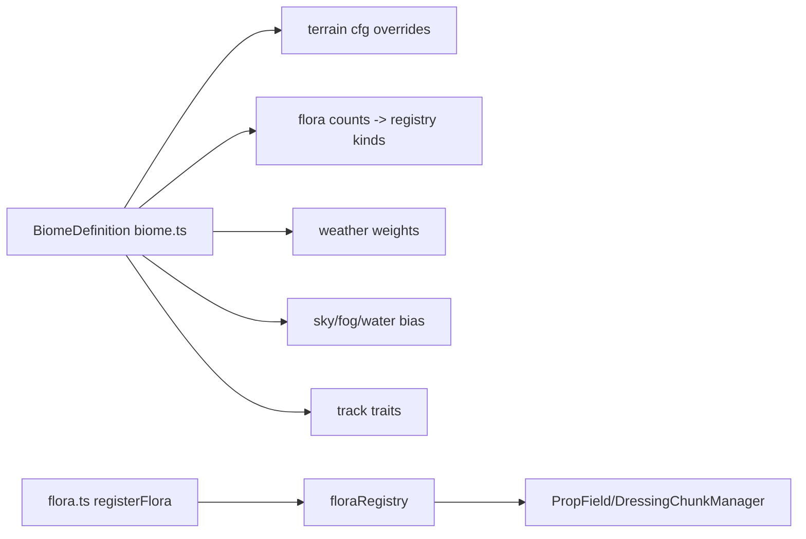

# Biome Guidelines

Owns the biome framework: per-biome data, flora builders, and each biome's
art + vibe identity. A biome is one directory here; everything unique to a
biome (definition, flora, future biome-only effects/audio) lives inside its
dir. Shared placement/weather machinery stays one level up (`../`); the
height surface stays in `../../terrain/`.

## Directory Map

```text
./src/environment/biomes/         # biome framework + one dir per biome
├── definition.ts        # BiomeDefinition/FloraEntry/BiomeWeather types
├── registry.ts          # BIOMES record + BIOME_ORDER index + resolve fns
├── validate.ts          # validateBiome(def, ctx) findings; thresholds
├── temperate/           # warm painted baseline; see temperate/AGENTS.md
├── desert/              # sun-bleached dunes; see desert/AGENTS.md
├── alpine/              # granite massifs; see alpine/AGENTS.md
├── tundra/              # nordic register; see tundra/AGENTS.md
├── tropical/            # golden-hour shore; see tropical/AGENTS.md
├── autumn/              # enchanted autumn forest; see autumn/AGENTS.md
└── *.test.ts            # jsdom suites (no WebGL)
```

Each biome dir: `biome.ts` (definition) + `flora.ts` (builders) + an
`AGENTS.md` naming its vibe and linking its art + vibe guide.

## Biome Data Flow



## Framework rules

- A biome is pure data (`biome.ts`) + registered flora builders
  (`flora.ts`). No biome imports another biome.
- `registry.ts` assembles `BIOMES`; `BIOME_ORDER` is APPEND-ONLY (stable
  circuit-code index — reordering remaps shared codes in the wild).
- Temperate is the parity baseline: empty overrides, bit-identical to
  `DEFAULT_TERRAIN_CONFIG`.
- Each biome dir carries its art + vibe guide link in its `AGENTS.md`;
  guides live in `docs/knowledge/biomes/<id>.md`. The vibe guide is the
  contract for palette, mood, AND future per-biome music/audio.
- Side-effect flora imports are wired in `../PropField.ts`;
  registering a biome there + here makes it appear in the menu and the
  visual-verify screenshot matrix with zero extra wiring.

## Authoring a biome

Use flora archetypes first (`../flora/archetypes.ts`); bespoke
builders stay first-class when knobs cannot express a shape. Register one
line per kind:

```ts
import { registerFlora } from "../../floraRegistry";
import { canopyTree } from "../../flora/archetypes";

registerFlora("mytree", canopyTree({ canopyR: 2.6, foliage: [0x3f8a3a] }));
```

Then: add `<id>/biome.ts`, append to `BIOMES` + `BIOME_ORDER`
(`registry.ts`), import the flora module in `../PropField.ts`,
and write the vibe guide (`docs/knowledge/biomes/<id>.md`). `validateBiome`
(`validate.ts`) must return zero errors — the registry suite runs it for
every registered biome.

## Knowledge Docs

Architecture details → `@docs/knowledge/biomes/index.md`. Update the
matching concept in the same commit when source behavior changes. Verify
claims against source code. Run `npm run lint:okf` after edits.

## See also

- `../../terrain/AGENTS.md` -> height surface, circuits, chunk streaming.
- `docs/knowledge/conventions/art-direction.md` -> global art contract.
