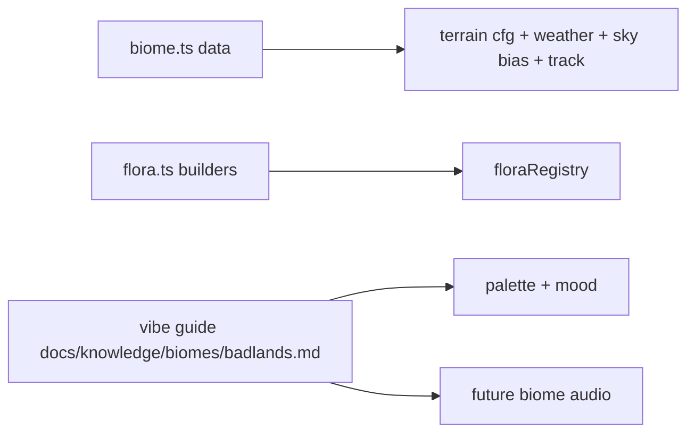

# Badlands Biome

Sun-baked red-rock canyon country: rust-red mesas, slot-canyon shortcuts,
drifting dust, sparse dry scrub, and squat junipers over eroded sandstone.
Dry and stony — no water anywhere.

Art style + vibe guide (the contract for palette, mood, and future
per-biome music/audio): `docs/knowledge/biomes/badlands.md`. Framework rules:
`../AGENTS.md`; wiki index: `@docs/knowledge/biomes/index.md`.

## Directory Map

```text
./src/environment/biomes/badlands/
├── biome.ts       # BiomeDefinition: terrain/flora/weather/sky/track data
├── flora.ts       # prop builders; registerFlora at module load
└── flora.test.ts  # jsdom suite (no WebGL)
```

## Biome Fan-Out



Everything unique to this biome (definition, flora, future biome-only
effects/audio) lives in this dir. Keep palette + mood changes in sync
with the vibe guide in the same commit.
