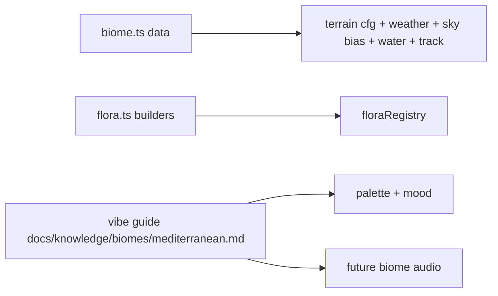

# Mediterranean Biome

Sunlit golden-hills vineyard country: dry golden grass over broad rolling
slopes, dark cypress spires and pale poplars, vine rows and lavender,
sun-bleached limestone, amber haze on the horizon. Warm and dry — water is a
thread in a gully, never the headline.

Art style + vibe guide (the contract for palette, mood, and future
per-biome music/audio): `docs/knowledge/biomes/mediterranean.md`. Framework
rules: `../AGENTS.md`; wiki index: `@docs/knowledge/biomes/index.md`.

## Directory Map

```text
./src/environment/biomes/mediterranean/
├── biome.ts       # BiomeDefinition: terrain/flora/weather/sky/water/track data
├── flora.ts       # prop builders; registerFlora at module load
├── biome.test.ts  # jsdom suite: definition data
└── flora.test.ts  # jsdom suite (no WebGL)
```

## Biome Fan-Out



The vineyard row read lives in the `vineRow` PROP (a trellis segment), not in
placement — the shared jittered sampler stays untouched. Everything unique to
this biome lives in this dir; keep palette + mood changes in sync with the
vibe guide in the same commit.
