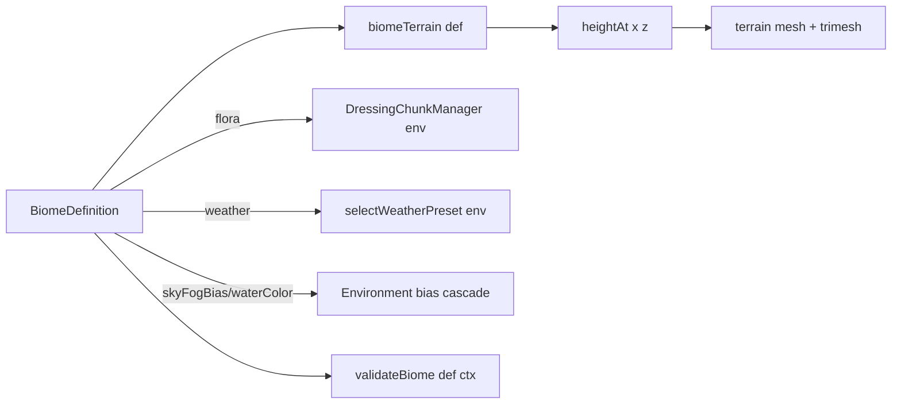

# Terrain Guidelines

Owns the height-truth surface, the biome data framework, and per-chunk
streaming. Biomes are pure data here; flora archetypes live in
`../environment/flora/archetypes.ts`; weather presets live in
`../environment/` (see `../environment/AGENTS.md`).

## Directory Map

```text
./src/terrain/        # terrain surface + biome data
├── biomes.ts            # BiomeDefinition registry + resolve/biomeTerrain
├── biomeValidate.ts     # validateBiome(def, ctx) findings; thresholds
├── heightmap.ts         # DEFAULT_TERRAIN_CONFIG + heightAt core
├── noise.ts             # SimplexNoise2D field hills
├── circuit.ts           # generateCircuit(seed, traits): attempts + gate
├── circuitGen.ts        # buildMainline pipeline (hull/fillet/fold/chicane)
├── circuitShape.ts      # pure 2D loop primitives (arcs, relax, displace)
├── circuitWidth.ts      # 059 width profile (harmonics, slope, start floor)
├── circuitBranch.ts     # 060 branch gen + validation (split/rejoin)
├── trackTraits.ts       # per-biome track character (width, branch bias)
├── trackGraph.ts        # SampleIndex + TrackEdge/TrackGraph (width, branches)
├── trackMarkers.ts      # 060 TrackMarker shape + markerWorldPose (empty)
├── SplineTrack.ts       # closed loop: spawn, AI, race, map source
├── heightSource.ts      # HeightSource iface + WorldHeightSource adapter
├── chunkBuilder.ts      # pure per-chunk geometry (buildChunk/buildSkirt)
├── streamGrid.ts        # signed-grid chunk helpers (shared w/ dressing)
├── Terrain.ts           # trimesh collider + visual mesh from heightAt
├── TerrainChunkManager.ts # streams chunks around camera focus
├── terrainLod.ts        # distance LOD for chunk meshes
└── *.test.ts            # jsdom suites (no WebGL)
```

## Track graph (059/060)

`trackGraph.ts` `TrackEdge` = equal-arc station table (pos + halfWidth per
station) with `pointAt/tangentAt/halfWidthAt/progressAt`. Edge 0 wraps the
mainline `SplineTrack` sample arrays (closed; station t = i/n bit-matches
`st`); branch edges are open, anchored at mainline params tA/tB, and
`progressAt` PROJECTS onto the mainline parameterization, so race progress
stays one scalar t. `TrackGraph.closestOnGraph(x,z)` = true nearest station
over all edges (one `SampleIndex` per edge) with pathY RIDGE-blended toward
the second-nearest distinct edge inside RIDGE_BLEND=24 (junctions crease-
free). `SplineFieldCache` bakes {dist, pathY, t, halfWidth, edgeId};
`queryPose` t/halfWidth are SAME-EDGE bilinears (never blend a mainline t
with a branch's projected t). `heightFromField`/`colorFromField` read the
sample half-width (cfg.trackHalfWidth is only the no-graph fallback).
`Terrain.graphPose` (exact, edge-local) and `Terrain.corridorClearance`
(dist - halfWidth) are the consumer surfaces.

Branches (`circuitBranch.ts`): shortcut = Hermite chord-cut across a curved
window (narrow 3.5-4.5, radius floor 12.5); scenic = outward plateau-bow on
a long straight-ish window (wide 7.5-9, floor 25, needs ~200 m). Window in
t [0.08, 0.92], span <= 0.22 lap (< FORWARD_CUT 0.34 -> a cross-route hop
degrades to a sector move). Separation: >= SEP_MIN_BRANCH=26 outside
junction RAMPS (0.38 arc each end); inside a ramp the nearest mainline
point must be the branch's OWN window; plateau coverage floor; drop-on-
failure after 24 draws keeps every seed valid. Deferred by invariant:
same-level crossroads (one (x,z) -> one t) and bridges (heightAt is
single-valued). Route walking + AI choice: `../race/routing.ts` +
`../race/routeChoice.ts`.

## Biome Framework

A biome is pure data: a `BiomeDefinition` (`biomes.ts`) resolved against
`DEFAULT_TERRAIN_CONFIG`. The framework is data-only here; visual dressing
(flora) + mood (weather) fan out in `../environment/`.



### BiomeDefinition shape (`biomes.ts`)

- `id` -> identity; `resolveBiome(id)` (unknown -> temperate, never throws).
- `label` -> menu display label.
- `terrain: Partial<TerrainConfig>` -> OVERRIDES only; spread over
  `DEFAULT_TERRAIN_CONFIG` by `biomeTerrain(def)` (single resolution point).
  Keys: `noiseAmp/noiseFreq/noiseOctaves/rockSlope/sandLevel/colorRoad/
colorGrass/colorSand/colorRock` + a few noise seeds.
- `flora: ReadonlyArray<{kind,count}>` -> kind name (flora registry) +
  PER-CHUNK count (not per-world).
- `weather: Record<string,number>` -> preset weights; resolved by
  `selectWeatherPreset` (cumulative sum; only relative weights matter).
- `waterColor?` -> water surface tint (sRGB hex); undefined = default.
- `waterLevel?` -> water plane height; undefined = sandLevel default.
- `skyFogBias?: {fogTint?,skyTint?}` -> Environment lerps fog + sky toward
  these by 0.2 (biome bias cascade).
- `wildlife?` -> ambient critter kinds; undefined opts out.

`MAX_BIG_PROPS_PER_CHUNK = 8` (shared by validator + streaming budget).
`selectBiome(seed)` -> deterministic equal-weight roll across `BIOMES`.

### Temperate parity invariant

Temperate is the baseline: `terrain: {}` + all optionals undefined.
`biomeTerrain(temperate)` is bit-identical to the pre-biome
`DEFAULT_TERRAIN_CONFIG`. Keep it that way; the registry suite asserts it.

## Authoring a biome

Copy tundra (`../environment/flora/tundra.ts`): smallest archetype-based
biome (pine/iceRock/snowBush). Add a `BiomeDefinition` to `BIOMES`, run the
validator + the registry suite. A reader following this section ships one.

### Flora via archetypes

Five parameterized builders in `../environment/flora/archetypes.ts`; each
takes a config of knobs and returns the `{build,big,collider}` shape
`registerFlora` consumes. Full knob names/defaults live in that source
(single source of truth). One-line shapes:

- `coniferTree` -> stacked-cone conifer (fir/spruce/pine spire). Big,
  cylinder collider.
- `canopyTree` -> canopy-on-trunk broadleaf. Big, cylinder collider.
- `ballRock` -> noisy dodecahedron rock. Big, ball collider sharing the
  visual radius (same first RNG draw).
- `lumpyShrub` -> squashed icosahedron shrub. Decor, no collider.
- `groundDecor` -> flat ground decor: "blade" (grass) or "petal" (flower).
  Decor, no collider.

Big props: Rapier body + merge into spatial buckets (one mesh/bucket).
Decor: InstancedMesh, no collider. Vertex budgets: big <= 600 tris, decor
<= 60 tris (`archetypes.test.ts` enforces). All geometry base-at-y=0,
deterministic from seed, WebGL-free (jsdom-testable). Register one line:

```ts
import { registerFlora } from "../floraRegistry";
import { canopyTree } from "./archetypes";

registerFlora("mytree", canopyTree({ canopyR: 2.6, foliage: [0x3f8a3a] }));
```

Override just `collider` by spreading the archetype + replacing the field
(tundra pins the pine cylinder to halfHeight 2.5 / radius 0.8).

### Bespoke escape hatch

The `{build,big,collider}` contract is unchanged, so bespoke builders stay
first-class. Try an archetype first; if a shape the knobs cannot express is
load-bearing for the biome's read, write a bespoke builder returning the
same shape and `registerFlora` it. Reference bespoke: saguaro arms
(`../environment/flora/desert.ts` `cactus`), mangrove root skirt (029).
Author base-at-y=0, deterministic, WebGL-free, <= 600 lines.

### Validator

`validateBiome(def, ctx)` (`biomeValidate.ts`) returns findings; empty =
clean. Errors block; warns advise. Static checks always run; dynamic checks
(`DRIVE_GRADE`, `WATER_FLORA_SUNK`) run only when `ctx.heightAt` +
`ctx.corridor` are provided. Build the real ctx in
`biomes.registry.test.ts`: `registeredKinds`/`isBigKind` from floraRegistry,
`knownWeatherKeys` = `clear` + `WEATHER_PRESET_CONFIG` keys,
`bigPerChunkCap` = `MAX_BIG_PROPS_PER_CHUNK`, `heightAt` via
`SplineFieldCache` + `SimplexNoise2D(biomeTerrain(def))`, `corridor` = 64
arc-length-even centerline points off `SplineTrack`.

| Code                  | Lvl   | Means / fix                       |
| --------------------- | ----- | --------------------------------- |
| `FLORA_NEG`           | error | count < 0 -> set non-negative.    |
| `FLORA_UNKNOWN`       | error | kind not registered -> fix typo.  |
| `FLORA_COUNT`         | error | big sum > 8/chunk -> lower.       |
| `WEATHER_NEG`         | error | weight < 0 -> set >= 0.           |
| `WEATHER_UNKNOWN`     | error | key not a preset -> fix or add.   |
| `WEATHER_SUM`         | error | sum <= 0 -> biome always-clears.  |
| `PALETTE_READABILITY` | warn  | band contrast < 0.10 -> spread.   |
| `DRIVE_GRADE`         | error | step > 1.0 or grade > 0.25 wall.  |
| `WATER_FLORA_SUNK`    | warn  | floor < waterLevel -> sunk (043). |

Thresholds (named next to each constant in `biomeValidate.ts`):
`STEP_DELTA_CAP = 1.0` (4x kart suspension travel 0.25),
`GRADE_CAP = 0.25` (tan ~14 deg), `PALETTE_CONTRAST_FLOOR = 0.10`.

Corridor is biome-independent: `heightAt` on the centerline == `spline.y`
(terrain noise weight 0 on-track), so `DRIVE_GRADE` guards the shared
SPLINE, not biome relief (that lives off-corridor and is what
`WATER_FLORA_SUNK`'s floor sampling touches).

## Scene auto-inclusion

Plan 052's visual-verify matrix + the menu both read `BIOMES`, so a newly
registered biome appears in the screenshot matrix + menu with zero extra
wiring.

## See also

- `../environment/AGENTS.md` -> weather framework + biome bias cascade.
- `../environment/flora/archetypes.ts` -> full flora archetype knobs.
- 055 biome-authoring-kit, 043 flora-avoids-water, 052 visual-verify.
