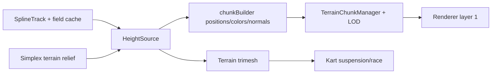

# Terrain Guidelines

Owns the height-truth surface, circuit generation, and per-chunk streaming.
Biome data lives in `../environment/biomes/` (see its `AGENTS.md`); this
dir consumes a resolved `TerrainConfig` (`biomeTerrain` merges biome
overrides over `DEFAULT_TERRAIN_CONFIG`).

## Directory Map

```text
./src/terrain/        # terrain surface + circuits + streaming
├── heightmap.ts         # DEFAULT_TERRAIN_CONFIG + heightAt core
├── noise.ts             # SimplexNoise2D field hills
├── circuit.ts           # generateCircuit(seed, traits): attempts + gate
├── circuitArchetype.ts  # 084 layout personalities: draw + opts bases + gates
├── circuitCode.ts       # 058 short-code codec: CircuitId encode/parse/CRC-8
├── circuitGen.ts        # buildMainline pipeline (hull/fillet/fold/chicane)
├── circuitShape.ts      # pure 2D loop primitives (arcs, relax, displace)
├── circuitWidth.ts      # 059 width profile (harmonics, slope, start floor)
├── circuitBank.ts       # 084 bank profile from curvature (masked, capped)
├── circuitBranch.ts     # 060 branch gen + validation (split/rejoin)
├── trackTraits.ts       # per-biome track character (width, branch bias)
├── stationProfile.ts    # piecewise-linear station profiles (width, bank)
├── trackGraph.ts        # SampleIndex + TrackEdge/TrackGraph (width, branches)
├── trackMarkers.ts      # 060 TrackMarker shape + markerWorldPose (empty)
├── SplineTrack.ts       # closed loop: spawn, AI, race, map source
├── heightSource.ts      # HeightSource iface + WorldHeightSource adapter
├── chunkBuilder.ts      # pure per-chunk geometry (buildChunk/buildSkirt)
├── chunkHeightTexture.ts # bake heightfield -> float DataTexture (normals)
├── chunkSeed.ts         # 206 ChunkSeeder: deferred seed queue + drain plan
├── streamGrid.ts        # signed-grid chunk helpers (shared w/ dressing)
├── Terrain.ts           # trimesh collider + visual mesh from heightAt
├── TerrainChunkManager.ts # streams chunks around camera focus
├── terrainLod.ts        # distance LOD for chunk meshes
└── *.test.ts            # jsdom suites (no WebGL)
```

## Track graph (059/060)

`trackGraph.ts` `TrackEdge` = equal-arc station table (pos + halfWidth per
station) with `pointAt/tangentAt/halfWidthAt/progressAt`. Edge 0 wraps the
mainline `SplineTrack` sample arrays (closed; station t = i/n bit-matches
`st`); branch edges are open, anchored at mainline params tA/tB, and
`progressAt` PROJECTS onto the mainline parameterization, so race progress
stays one scalar t. `TrackGraph.closestOnGraph(x,z)` = true nearest station
over all edges (one `SampleIndex` per edge) with pathY RIDGE-blended toward
the second-nearest distinct edge inside RIDGE_BLEND=24 (junctions crease-
free). `SplineFieldCache` bakes {dist, pathY, t, halfWidth, edgeId};
`queryPose` t/halfWidth are SAME-EDGE bilinears (never blend a mainline t
with a branch's projected t). `heightFromField`/`colorFromField` read the
sample half-width (cfg.trackHalfWidth is only the no-graph fallback).
`Terrain.graphPose` (exact, edge-local) and `Terrain.corridorClearance`
(dist - halfWidth) are the consumer surfaces.

Branches (`circuitBranch.ts`): shortcut = Hermite chord-cut across a curved
window (narrow 3.5-4.5, radius floor 12.5); scenic = outward plateau-bow on
a long straight-ish window (wide 7.5-9, floor 25, needs ~200 m). Window in
t [0.08, 0.92], span <= 0.22 lap (< FORWARD_CUT 0.34 -> a cross-route hop
degrades to a sector move). Separation: >= SEP_MIN_BRANCH=26 outside
junction RAMPS (0.38 arc each end); inside a ramp the nearest mainline
point must be the branch's OWN window; plateau coverage floor. A deterministic
window scan caps full validations at `MAX_VALIDATIONS=60`; drop-on-failure
keeps every seed valid. Deferred by invariant:
same-level crossroads (one (x,z) -> one t) and bridges (heightAt is
single-valued). Route walking + AI choice: `../race/routing.ts` +
`../race/routeChoice.ts`.

## Height And Chunk Flow



## Knowledge Docs

Architecture details → `@docs/knowledge/terrain/index.md`. Update the matching
concept in the same commit when source behavior changes. Verify claims against
source code. Run `npm run lint:okf` after edits.

## See also

- `../environment/biomes/AGENTS.md` -> biome framework + authoring runbook.
- `../environment/AGENTS.md` -> weather framework + biome bias cascade.
- `docs/knowledge/terrain/` -> terrain, circuit, and chunk details.
