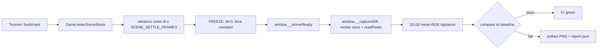

# Visual Verify Harness

Pixel regression gate for the game's look (cel bands, outlines, posterized
sky, biome palettes). Drives headless Chromium through `?scene=` bookmark
URLs, captures a deterministic still per scene, downsamples to a text
signature, and compares against committed baselines. NOT part of
`npm run verify` (that stays WebGL-free/fast); visual is its own CI gate.

## Directory Map

```text
./tools/visual/
├── signature.mjs       # PURE: RGBA -> 32x18 mean-RGB grid + compare
├── signature.test.mjs  # vitest unit tests (no GL)
├── run.mjs             # Playwright runner: build + preview + capture/check
├── scenes.json         # scene matrix v1 (13 scenes)
├── baselines/*.json    # committed text baselines (one per scene)
└── AGENTS.md           # this file
```

## Capture Pipeline



## Scene Mode Contract

- Bookmark URL = `?scene=` + comma-separated `key:value` tokens:
  `biome:<id>`, `tod:<preset|hours>`, `weather:<mode>`, `cam:menu|chase`,
  `camT:<0..1>` (menu-cam spline t), `time:<sec>` (per-frame dt pre-freeze).
- Registered biomes: temperate/desert/alpine/tundra. tod presets:
  dawn/morning/noon/afternoon/dusk/night, or decimal hours 0-24.
  Tokens order-independent; unknown keys ignored; bad values fall back.
- `Game.enterSceneMode` applies the bookmark (rebuild world on biome
  change, pin menu-cam at camT, freeze time-of-day, apply weather).
- `frameScene` advances a constant `bm.time` dt for `SCENE_SETTLE_FRAMES`
  (8) so converge lerps + DynamicSky settle, then FREEZES: dt=0 and
  `this.time` held constant -> every post-settle frame byte-identical
  (water/cloud/weather uTime, wildlife orbits, lightning phase pinned).
- Sets `window.__sceneReady` on the first frozen frame (idempotent); that
  flag is the runner's SOLE readiness signal -> capture timing-insensitive.

## Capture Path

- Runner awaits `__sceneReady`, then calls `window.__captureStill`
  (Game's scene-mode hook): renders the frozen scene ONCE through the full
  composer, then `gl.readPixels` in the SAME JS task -> three.js
  `preserveDrawingBuffer:false` is irrelevant (framebuffer valid until the
  next composite swap).
- Measured determinism: byte-identical BOTH within a browser session AND
  across separate browser processes (13/13 scenes, 0 delta). Software GL
  (SwiftShader/ANGLE) is CPU-rasterized and arch-stable -> local macOS
  arm64 baselines are byte-identical to CI linux.
- Raw GL framebuffer has bottom-left origin; left unflipped because baseline
  and capture share the orientation.
- A viewable PNG is ALSO saved via compositor screenshot for human
  eyeballing ONLY; it is NOT the signature source (Playwright's
  element.screenshot recomposite shimmered 55-103 RGB within-session).

## Commands

- `npm run visual:check` -> build + preview + compare all scenes vs
  baselines; nonzero exit if any scene fails.
- `npm run visual:capture` -> rewrite `baselines/*.json` (review + commit).
- `node tools/visual/run.mjs check temperate` -> filter scenes by id
  substring (also accepts `capture` as the mode).
- `npx playwright install chromium` -> install the headless browser. An
  absent browser is a graceful skip (exit 0) so CI never fails pre-install.
- `VISUAL_SKIP_BUILD=1 npm run visual:check` -> reuse a prebuilt `dist/`.

## Reading A Failure

A failure is a real pixel change, never flakiness (byte-identical). To
diagnose: download the `visual-artifacts` GitHub Actions artifact, open
`.agent/visual/<id>.png` next to `report.json` (per-scene `maxCellDelta`,
`cellsOverTol`, `meanCellDelta`), and compare the PNG against the committed
baseline. `report.json` is the machine truth; the PNG is the human truth.

## Rebaselining

Legitimate ONLY for an intended look change: biome palette, cel bands,
outline/posterize, a material/sky/shader change, or a `three` bump that
changes rasterization. NOT for flakiness (there is none). Steps:

1. Make the intended change.
2. `npm run visual:capture` (rewrites `tools/visual/baselines/*.json`).
3. `git diff tools/visual/baselines/` -> review which cells moved.
4. Commit. The rebaseline commit body MUST state WHY (what look change it
   records); a bodyless rebaseline is a policy violation.

## Tolerance

Defaults strict: `DEFAULT_TOLERANCE=30` (per-cell Euclidean RGB distance),
`DEFAULT_MAX_CELLS_OVER_TOL=0`. A real look change moves dozens of the 576
cells and fails cleanly. Relax (per-cell tolerance or `maxCellsOverTol`)
ONLY if a future rasterizer genuinely shimmers, and document the reason
inline at the relaxation site. CI-bound baselines are the reference;
software-GL parity means local baselines match CI.

## CI And Burn-In

`.github/workflows/visual.yml` Visual job runs on PR + push to main; the
Visual gate step is `continue-on-error: true` for a BURN-IN period. It
uploads `.agent/visual/` (PNGs + report.json) on pass AND fail. Promotion:
once green across PRs, remove `continue-on-error` from the gate step and
add `visual` as a required status check on main branch protection.

## Policy

NO committed images (repo asset policy). Baselines are text only (hex
strings, every line <= 100 chars). PNGs live only under gitignored
`.agent/visual/` and transient CI artifacts. Never commit a `.png` here.
